# AI Food Recommendation

Demo antarmuka aplikasi mobile rekomendasi makanan harian berdasarkan profil,
target kalori, dan preferensi pengguna. Aplikasi dibangun menggunakan Ionic Vue
dan TypeScript sebagai bagian dari tugas akhir kuliah.

> [!NOTE]
> Proyek saat ini berada pada tahap **demo UI** untuk dokumentasi dan screenshot
> laporan. Seluruh informasi pengguna, rekomendasi makanan, serta interaksi di
> dalam aplikasi masih menggunakan data dummy lokal. Backend, autentikasi nyata,
> database, dan recommendation engine akan dikembangkan pada tahap berikutnya.

## Fitur demo

- Login dan registrasi pengguna
- Pengaturan, tampilan, dan penyuntingan profil
- Beranda dengan ringkasan target kalori
- Rekomendasi menu harian
- Detail makanan dan informasi makronutrisi
- Pilihan alternatif dan penggantian menu
- Feedback suka, tidak suka, dan sudah dikonsumsi
- Loading, empty, dan error state
- Navigasi mobile dengan bottom navigation

## Tampilan aplikasi

### Autentikasi

| Login | Registrasi |
| :---: | :---: |
| 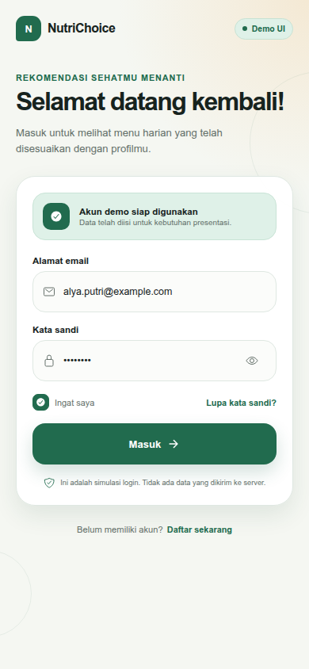 | 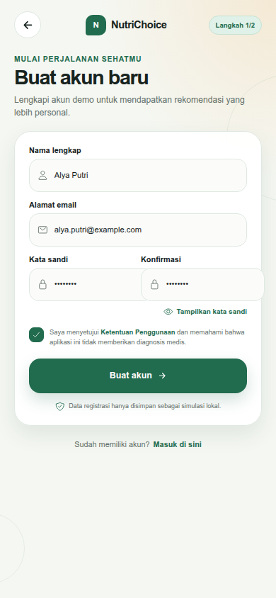 |

### Beranda dan rekomendasi

| Beranda | Rekomendasi harian |
| :---: | :---: |
| 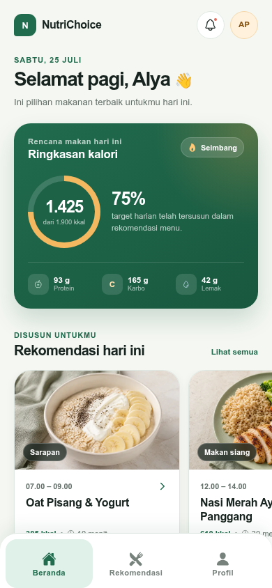 | 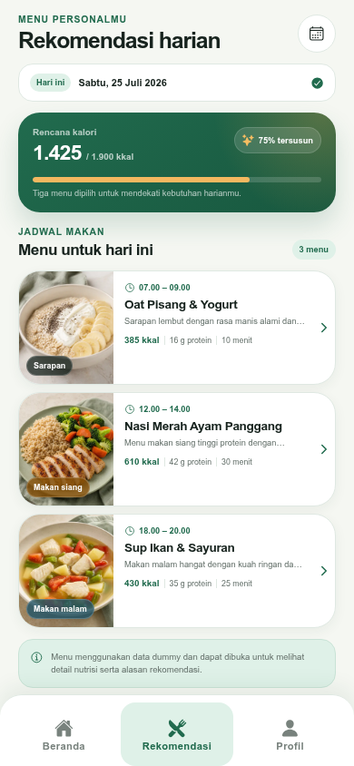 |

### Detail dan feedback menu

| Detail menu | Feedback suka |
| :---: | :---: |
| 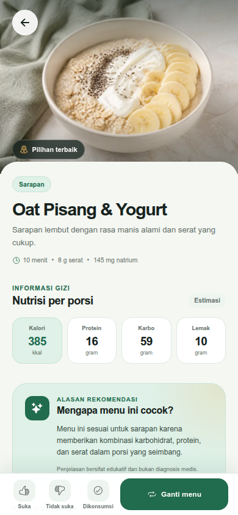 | 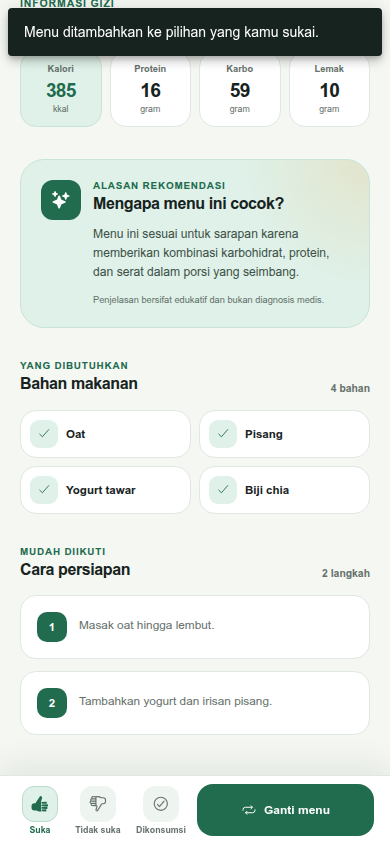 |

### Penggantian rekomendasi

| Pilihan alternatif | Setelah menu diganti |
| :---: | :---: |
| 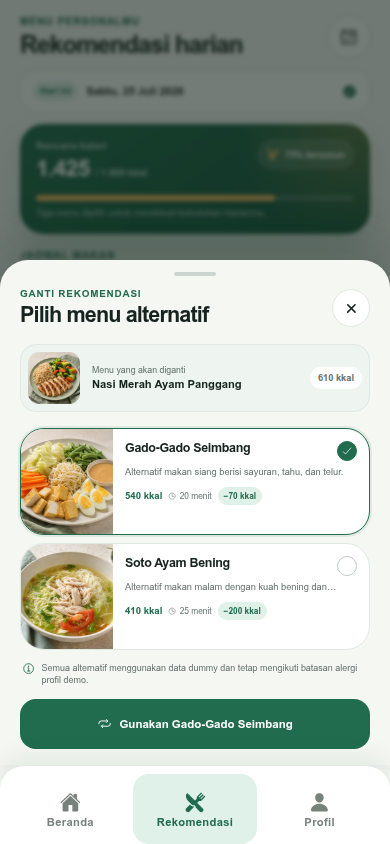 | 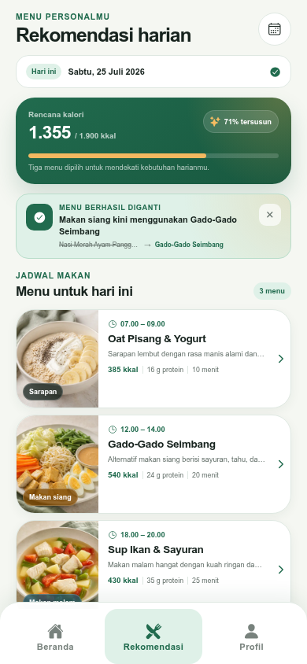 |

### Profil pengguna

| Pengaturan profil | Profil | Edit profil |
| :---: | :---: | :---: |
| 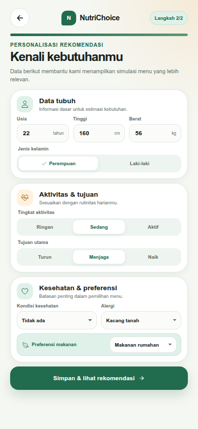 | 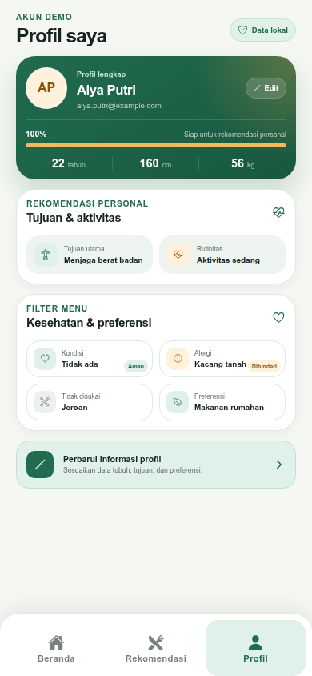 | 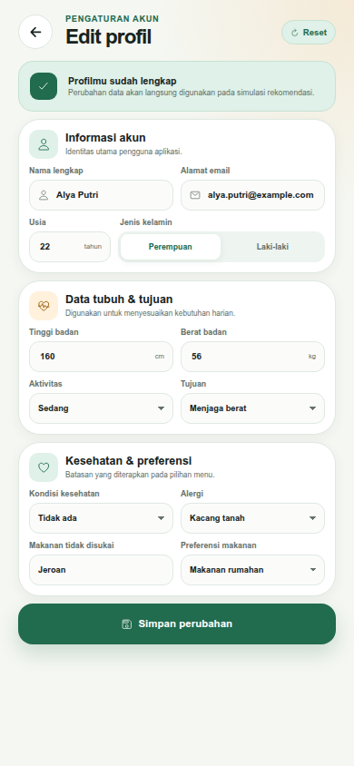 |

### System states

| Loading | Empty | Error |
| :---: | :---: | :---: |
| 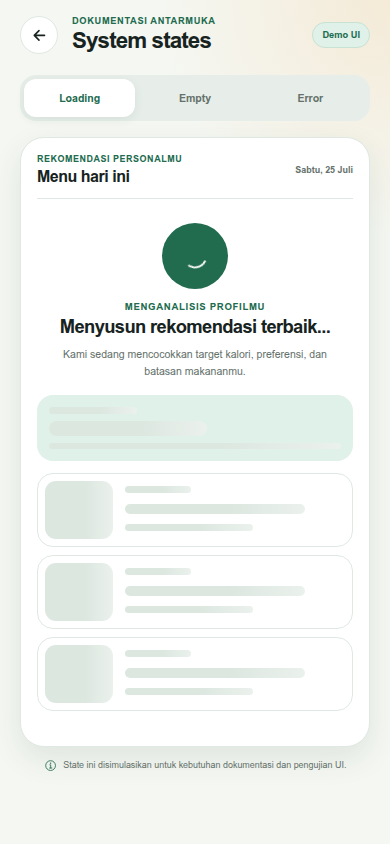 | 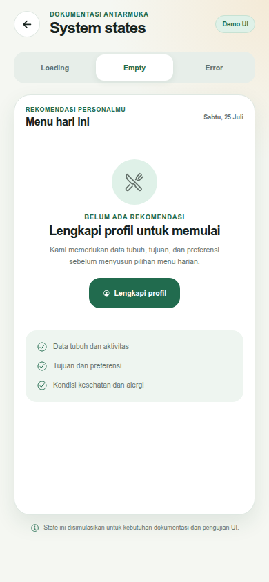 | 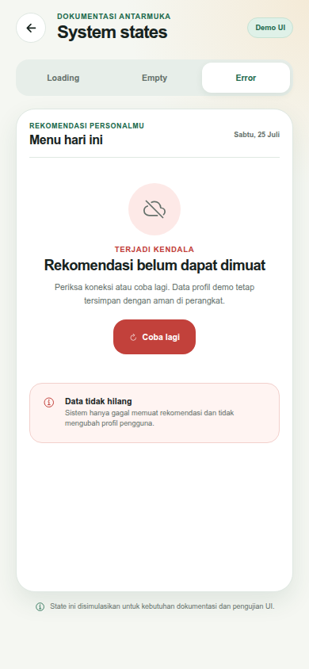 |

## Teknologi

- Ionic Framework 8
- Vue 3
- TypeScript
- Vue Router
- Pinia
- Capacitor
- Vite

## Menjalankan aplikasi

Pastikan Node.js dan npm sudah tersedia, kemudian jalankan:

```bash
cd mobile
npm install
npm run dev
```

Buka alamat yang ditampilkan oleh Vite pada browser. Route utama aplikasi
adalah `/app/home`.

## Validasi proyek

```bash
cd mobile
npm run build
npm run lint
npm run test:unit -- --run
```

## Struktur proyek

```text
.
├── laporan/       # Draft dan referensi laporan tugas akhir
├── mobile/        # Source code aplikasi Ionic Vue
├── screenshoots/  # Hasil screenshot antarmuka
├── plan.md        # Rencana dan tahapan pengembangan
└── README.md
```

## Status pengembangan

| Tahap | Status | Cakupan |
| --- | --- | --- |
| Demo UI | Sedang dikembangkan | Halaman aplikasi, dummy data, interaksi visual, dan screenshot |
| Integrated MVP | Berikutnya | Backend, autentikasi, database, recommendation engine, dan integrasi API |
| Pengembangan lanjutan | Direncanakan | Penyempurnaan fitur, pengujian, keamanan, dan deployment |

Proyek ini bersifat edukatif dan tidak ditujukan untuk memberikan diagnosis
atau menggantikan saran dari tenaga kesehatan.
