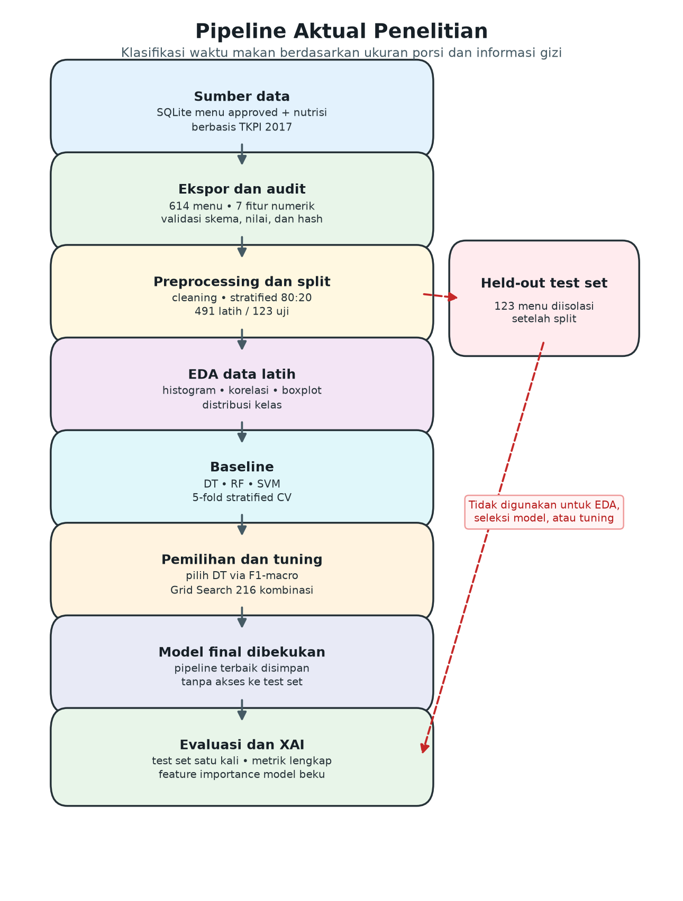
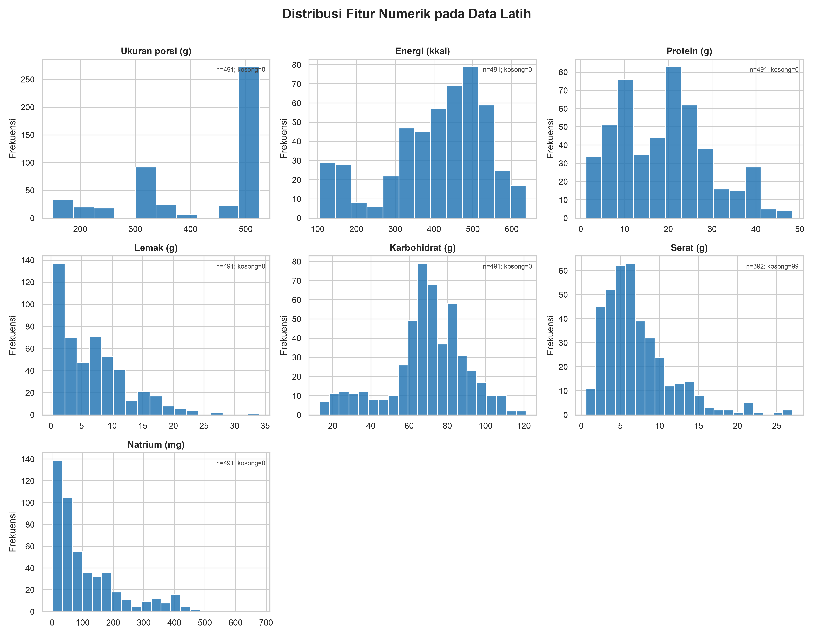
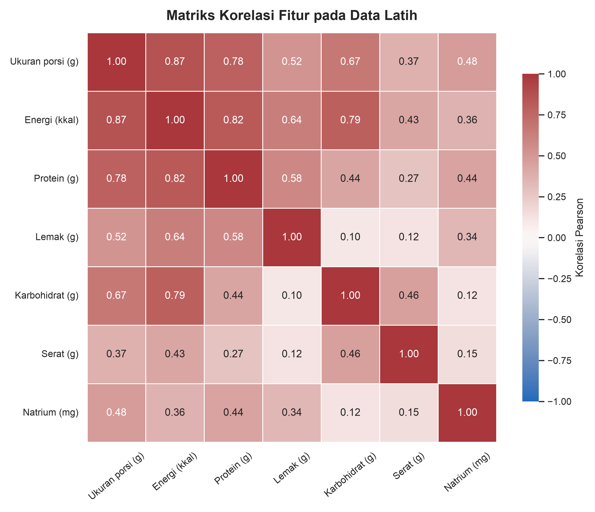
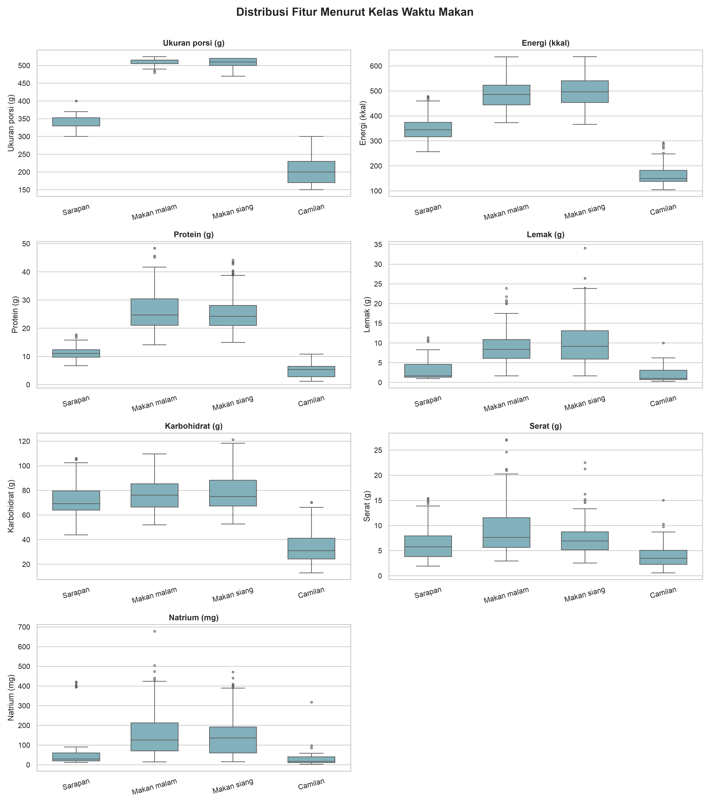
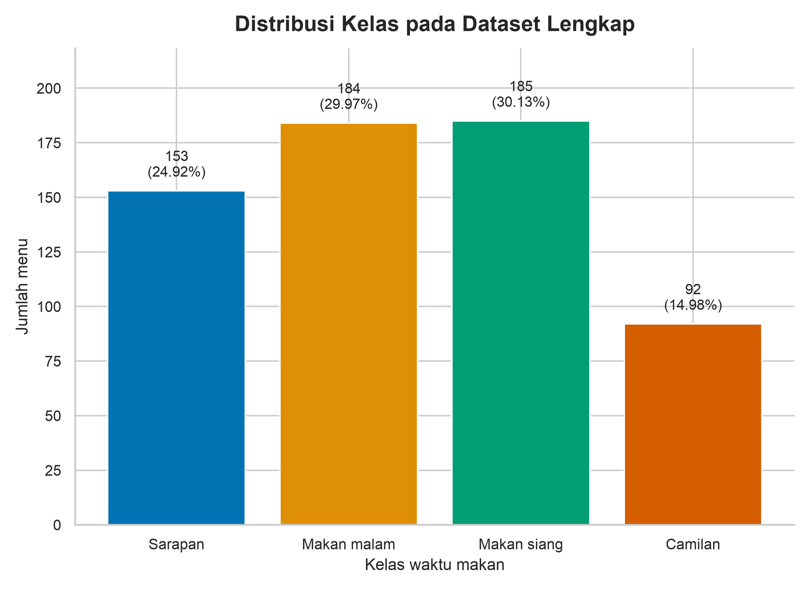
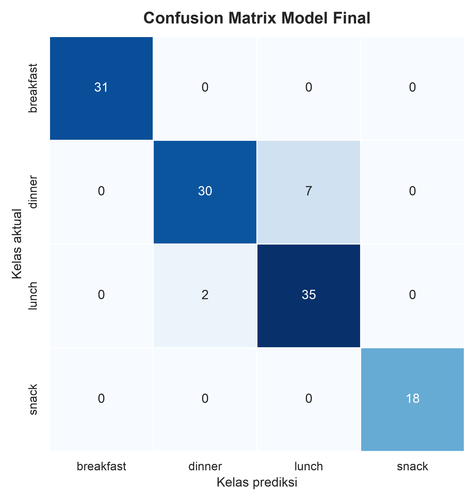
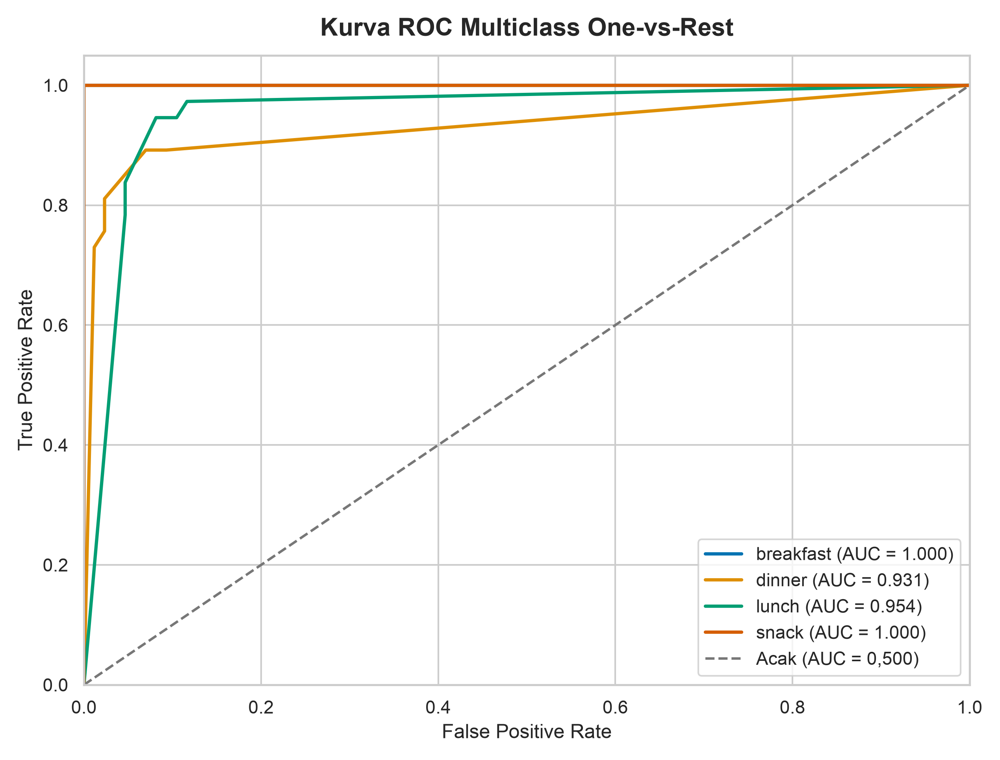

# Klasifikasi Waktu Makan Berdasarkan Informasi Gizi Menggunakan Decision Tree dan Explainable AI

## Laporan Proyek Kecerdasan Artifisial

**Nama:** Panji Jaya Sutra 
**NIM:** 20220801517 
**Kelas:** [KELAS] 
**Program Studi:** [PROGRAM STUDI] 
**Fakultas:** [FAKULTAS] 
**Universitas:** Universitas Esa Unggul 
**Mata Kuliah:** Kecerdasan Artificial 
**Dosen Pengampu:**  
**Tahun:** 2026 
**Repositori:** [github.com/panjivj/ai-food-recommendation](https://github.com/panjivj/ai-food-recommendation)

> **Status dokumen:** Draft laporan eksperimen. Placeholder yang tersisa hanya
> untuk informasi administratif yang belum diberikan dan kebutuhan
> pengumpulan akhir.

---

# Klasifikasi Waktu Makan Berdasarkan Informasi Gizi Menggunakan Decision Tree dan Explainable AI

**Panji Jaya Sutra**

[Program Studi], Universitas Esa Unggul 
[Kota, Indonesia] 
[Alamat surel penulis]

## Abstrak

Pengelompokan menu berdasarkan waktu makan dapat mendukung pengelolaan kandidat
menu pada sistem rekomendasi makanan. Penelitian ini membangun model
klasifikasi empat kelas waktu makan—`breakfast`, `lunch`, `dinner`, dan
`snack`—menggunakan tujuh fitur numerik berupa ukuran porsi, energi, protein,
lemak, karbohidrat, serat, dan natrium. Dataset terdiri atas 614 menu yang
dibagi secara stratified menjadi 491 data latih dan 123 data uji. Preprocessing
mencakup validasi dan cleaning, imputasi median, pemertahanan outlier yang masih
valid, encoding target, serta `RobustScaler` di dalam pipeline untuk mencegah
data leakage. Decision Tree, Random Forest, dan Support Vector Machine
dibandingkan dengan 5-fold stratified cross-validation. Decision Tree dipilih
berdasarkan F1-macro baseline tertinggi sebesar 0,9311 dan dituning melalui
Grid Search terhadap 216 kombinasi. Model final dievaluasi satu kali pada
held-out test set dan memperoleh accuracy 0,9268, precision-macro 0,9427,
recall-macro 0,9392, F1-macro 0,9389, serta ROC-AUC one-vs-rest macro 0,9714.
Kesembilan kesalahan klasifikasi hanya terjadi antara `dinner` dan `lunch`.
Impurity-based feature importance menunjukkan `serving_size_g` sebagai fitur
dominan dengan nilai 0,9401. Hasil ini menjelaskan perilaku model, bukan
hubungan sebab-akibat. Generalisasi penelitian masih dibatasi oleh satu sumber
dataset, satu held-out split, dan belum adanya validasi eksternal.

**Kata Kunci—** rekomendasi makanan, klasifikasi waktu makan, machine learning,
Decision Tree, explainable AI.

## Abstract

Meal-time classification can support candidate-menu organization in a food
recommender system. This study develops a four-class classifier for
`breakfast`, `lunch`, `dinner`, and `snack` using seven numerical features:
serving size, energy, protein, fat, carbohydrate, fiber, and sodium. The
dataset contains 614 menus and was stratified into 491 training and 123 test
instances. Preprocessing included validation and cleaning, median imputation,
retention of valid outliers, target encoding, and `RobustScaler` within the
model pipeline to prevent data leakage. Decision Tree, Random Forest, and
Support Vector Machine were compared using five-fold stratified
cross-validation. Decision Tree was selected based on the highest baseline
macro-F1 of 0.9311 and tuned using Grid Search over 216 combinations. The final
model was evaluated once on the held-out test set, achieving 0.9268 accuracy,
0.9427 macro-precision, 0.9392 macro-recall, 0.9389 macro-F1, and 0.9714
one-vs-rest macro ROC-AUC. All nine classification errors occurred between
`dinner` and `lunch`. Impurity-based feature importance identified
`serving_size_g` as the dominant feature with an importance of 0.9401. This
value describes the fitted model's behavior rather than a causal relationship.
Generalization remains limited by a single data source, one held-out split,
and the absence of external validation.

**Keywords—** food recommendation, meal-type classification, machine learning,
Decision Tree, explainable AI.

---

# I. Pendahuluan

## A. Latar Belakang

Ketersediaan pilihan makanan dalam jumlah besar membuat proses penyaringan menu
menjadi masalah yang relevan bagi sistem rekomendasi. Tinjauan sistematis
Bondevik *et al.* menunjukkan bahwa food recommender system merupakan domain
yang beragam; pendekatan content-based dan machine learning banyak digunakan,
tetapi pengolahan data, konteks, dan evaluasinya belum seragam [1]. Pada
konteks yang terkait kesehatan, rekomendasi tidak cukup hanya mengikuti
preferensi karena informasi gizi dan batasan pengguna juga perlu
dipertimbangkan [2].

Informasi gizi dapat menjadi representasi terstruktur untuk mengelompokkan
karakteristik pangan. Survei Gilal *et al.* menempatkan klasifikasi,
penghitungan kalori, penilaian kualitas, dan rekomendasi sebagai bagian dari
food computing, sekaligus menekankan tantangan keterwakilan dataset regional
[3]. Menichetti *et al.* menunjukkan bahwa kombinasi kandungan zat gizi dapat
digunakan Random Forest untuk memprediksi empat tingkat pemrosesan pangan [4].
Rai *et al.* juga membandingkan beberapa algoritma untuk klasifikasi bahan
pangan berdasarkan data nutrisi dan biokimia, dengan hasil yang berbeda
antaralgoritma [5]. Temuan-temuan tersebut mendukung penggunaan eksperimen
komparatif, tetapi tidak membuat hasil dari target dan dataset yang berbeda
dapat dibandingkan secara langsung.

Penelitian ini berfokus pada masalah yang lebih sempit, yaitu
mengklasifikasikan menu ke empat kelas waktu makan berdasarkan ukuran porsi dan
kandungan gizi. Klasifikasi ini diposisikan sebagai komponen pendukung untuk
pengelompokan kandidat menu, bukan sebagai sistem rekomendasi personal yang
lengkap. Decision Tree, Random Forest, dan Support Vector Machine dibandingkan
dengan prosedur validasi yang sama; model terpilih kemudian dituning,
dievaluasi pada test set terisolasi, dan dijelaskan menggunakan feature
importance.

Sistem dan hasil penelitian bersifat edukatif. Model tidak mempertimbangkan
diagnosis, terapi, alergi, kondisi medis individual, atau kebutuhan gizi
personal, sehingga tidak dimaksudkan sebagai pengganti konsultasi dengan
tenaga kesehatan.

## B. Identifikasi Masalah

Masalah yang diidentifikasi dalam ruang lingkup penelitian adalah:

1. Data menu pada aplikasi belum berbentuk dataset eksperimen yang diaudit dan
   siap digunakan oleh pipeline machine learning.
2. Terdapat missing value, perbedaan skala fitur, kandidat outlier, dan
   distribusi kelas yang perlu ditangani tanpa menimbulkan data leakage.
3. Belum diketahui kinerja relatif Decision Tree, Random Forest, dan Support
   Vector Machine untuk klasifikasi waktu makan pada dataset yang digunakan.
4. Model baseline terbaik masih memerlukan hyperparameter tuning dan evaluasi
   independen pada held-out test set.
5. Kontribusi relatif setiap fitur terhadap keputusan model final belum
   diketahui.

## C. Rumusan Masalah

Rumusan masalah awal penelitian ini adalah:

1. Bagaimana menyiapkan data menu dan kandungan gizinya agar dapat digunakan
   untuk klasifikasi waktu makan?
2. Bagaimana perbandingan kinerja Decision Tree, Random Forest, dan Support
   Vector Machine dalam mengklasifikasikan menu ke kelas waktu makan?
3. Bagaimana pengaruh hyperparameter tuning terhadap model baseline terbaik?
4. Fitur apa yang paling berpengaruh terhadap prediksi model final?

## D. Tujuan Penelitian

Penelitian ini bertujuan untuk:

1. Menyusun dataset eksperimen dari data menu yang telah tersedia.
2. Melakukan preprocessing dan eksplorasi terhadap data menu.
3. Membandingkan tiga algoritma klasifikasi, yaitu Decision Tree, Random Forest,
   dan Support Vector Machine.
4. Melakukan hyperparameter tuning terhadap model baseline terbaik.
5. Mengevaluasi dan menginterpretasikan model final.

## E. Batasan Penelitian

Batasan awal penelitian ini adalah:

1. Target klasifikasi dibatasi pada empat kelas waktu makan yang tersedia pada
   dataset, yaitu `breakfast`, `lunch`, `dinner`, dan `snack`.
2. Fitur model dibatasi pada atribut numerik yang tersedia dan lolos pemeriksaan
   kualitas data.
3. Model tidak digunakan untuk diagnosis medis atau penyusunan terapi gizi.
4. Personalisasi pada aplikasi utama tetap mengikuti aturan yang
   diimplementasikan oleh recommendation engine.
5. Model klasifikasi berfungsi sebagai komponen pendukung untuk mengelompokkan
   kesesuaian waktu makan suatu menu.
6. Penelitian dibatasi pada eksperimen, evaluasi, dan explainable AI terhadap
   model. Implementasi antarmuka Streamlit tidak termasuk dalam ruang lingkup
   yang telah dikonfirmasi.

## F. Kontribusi Penelitian

Kontribusi penelitian ini adalah:

1. Menghasilkan dataset eksperimen 614 menu beserta audit skema, kualitas,
   distribusi kelas, dan split yang dapat ditelusuri melalui hash.
2. Menyediakan pipeline preprocessing dan perbandingan tiga algoritma dengan
   prosedur cross-validation yang sama serta perlindungan terhadap data
   leakage.
3. Menghasilkan Decision Tree yang dituning, artefak model yang dapat dimuat
   ulang, dan evaluasi satu kali pada held-out test set dengan metrik
   multiclass yang lengkap.
4. Menyediakan penjelasan global melalui impurity-based feature importance,
   disertai batasan interpretasi dan artefak reproduksi eksperimen.

## G. Struktur Laporan

Bagian I menjelaskan latar belakang, rumusan masalah, tujuan, dan batasan
penelitian. Bagian II membahas penelitian terdahulu. Bagian III menjelaskan
metodologi penelitian. Bagian IV menyajikan hasil eksperimen. Bagian V membahas
hasil, keterbatasan, dan implikasinya. Bagian VI berisi kesimpulan dan saran.

---

# II. Studi Literatur

## A. Sistem Rekomendasi Makanan

Sistem rekomendasi makanan merupakan sistem penyaringan informasi yang
menyusun atau memeringkat kandidat makanan sesuai informasi item, preferensi,
riwayat interaksi, konteks, maupun kebutuhan pengguna. Pendekatannya dapat
berupa content-based, collaborative filtering, knowledge-based, atau hybrid.
Berbeda dari rekomendasi produk umum, rekomendasi makanan dapat melibatkan
tujuan gizi, alergi, kondisi kesehatan, kebiasaan, dan ketersediaan bahan.
Tinjauan Bondevik *et al.* terhadap 67 studi menunjukkan keberagaman tujuan,
data, metode, dan evaluasi food recommender system [1]. Tinjauan Yera *et al.*
pada sistem bagi pasien diabetes juga menegaskan perlunya menilai kebutuhan
kesehatan bersama preferensi pengguna [2].

Riset terkini memperlihatkan beberapa strategi. Li *et al.* dan Ma *et al.*
mengintegrasikan pengetahuan kesehatan atau nutrisi dengan preferensi dalam
knowledge graph [6], [7]. Huang *et al.* memperlakukan keseimbangan sembilan
zat gizi sebagai masalah optimasi multiobjektif setelah tahap collaborative
filtering [8]. Yap *et al.* menggabungkan K-nearest neighbors dan singular
value decomposition untuk prediksi rating makanan [9]. Buzcu *et al.*
menunjukkan bahwa penjelasan dan interaksi pengguna juga relevan pada virtual
coach bidang nutrisi [10]. Penelitian ini tidak membangun seluruh mekanisme
personalisasi tersebut. Model hanya mengklasifikasikan waktu makan sebagai
metadata pendukung untuk pengelompokan kandidat menu.

## B. Klasifikasi Menu Berdasarkan Informasi Gizi

Informasi gizi menyediakan representasi numerik yang dapat diproses oleh model
klasifikasi. Gilal *et al.* memetakan klasifikasi, estimasi kalori, penilaian
kualitas, dan rekomendasi sebagai tugas dalam food computing, sekaligus
menunjukkan bahwa ketersediaan dan keterwakilan dataset masih menjadi
tantangan [3]. Menichetti *et al.* menggunakan profil zat gizi dan Random
Forest untuk memprediksi empat tingkat pemrosesan pangan [4]. Rai *et al.*
membandingkan enam algoritma untuk mengklasifikasikan bahan pangan dari data
nutrisi dan biokimia; performanya berbeda menurut algoritma yang digunakan
[5].

Ketiga penelitian tersebut mendukung kelayakan fitur numerik pangan untuk
klasifikasi, tetapi targetnya bukan waktu makan. Karena kelas, sumber data,
fitur, dan protokol evaluasinya berbeda, angka kinerja mereka tidak digunakan
sebagai tolok ukur numerik langsung. Pada penelitian ini, ukuran porsi dan
enam kandungan gizi digunakan untuk memprediksi label `meal_type` yang telah
dikurasi.

## C. Algoritma Klasifikasi

### 1. Decision Tree

Decision Tree membagi ruang fitur secara rekursif menggunakan aturan ambang
yang menurunkan impurity kelas. Setiap jalur dari akar ke leaf membentuk aturan
keputusan, sehingga model relatif mudah ditelusuri. Pohon tanpa pembatasan
dapat menyesuaikan noise data; karena itu, kedalaman, jumlah minimum sampel
untuk split, dan jumlah minimum sampel pada leaf perlu dikendalikan [11].

### 2. Random Forest

Random Forest merupakan ensemble sejumlah Decision Tree yang dilatih pada
sampel bootstrap dan subset fitur yang dipilih secara acak. Agregasi prediksi
antar-pohon umumnya mengurangi varians dibandingkan satu pohon, meskipun model
menjadi kurang ringkas untuk dijelaskan. Algoritma ini digunakan sebagai
baseline ensemble dan telah digunakan untuk klasifikasi berbasis profil gizi
[4], [11].

### 3. Support Vector Machine

Support Vector Machine mencari hyperplane dengan margin pemisah yang besar.
Kernel radial basis function memetakan hubungan nonlinier melalui ukuran
kemiripan tanpa membentuk pemetaan fitur secara eksplisit. Parameter `C`
mengatur kompromi antara margin dan kesalahan klasifikasi, sedangkan `gamma`
mengatur jangkauan pengaruh sampel. Karena model sensitif terhadap skala fitur,
SVM pada penelitian ini ditempatkan setelah imputasi dan `RobustScaler` [11].

## D. Hyperparameter Tuning

Hyperparameter adalah konfigurasi yang ditentukan sebelum estimator di-fit.
Grid Search mengevaluasi seluruh kombinasi dalam ruang pencarian yang telah
ditetapkan dan memilih kombinasi berdasarkan skor validasi. Penelitian ini
menggunakan 5-fold stratified cross-validation dan F1-macro sebagai `refit`
metric. Imputer dan scaler berada di dalam pipeline agar parameternya hanya
dipelajari dari bagian latih pada setiap fold. Test set tidak digunakan untuk
memilih algoritma atau hyperparameter [11].

## E. Evaluasi Model Klasifikasi

Accuracy menyatakan proporsi seluruh prediksi yang benar. Precision mengukur
proporsi prediksi suatu kelas yang benar, recall mengukur proporsi anggota
aktual suatu kelas yang berhasil ditemukan, dan F1-score merupakan harmonic
mean precision dan recall. Confusion matrix menampilkan pasangan kelas aktual
dan prediksi sehingga jenis kesalahan dapat diperiksa. Karena target memiliki
empat kelas dengan jumlah yang tidak sama, precision, recall, dan F1 dihitung
dengan macro average, yaitu menghitung metrik setiap kelas lalu
merata-ratakannya tanpa pembobotan jumlah sampel [11].

ROC memetakan true-positive rate terhadap false-positive rate pada berbagai
ambang, sedangkan area under the curve merangkum kemampuan pemeringkatan skor.
Untuk kasus multiclass, penelitian ini menggunakan pendekatan one-vs-rest
(OVR): setiap kelas dibandingkan terhadap gabungan kelas lainnya. ROC-AUC
baseline dihitung dari decision score; evaluasi final menggunakan probabilitas
kelas dari Decision Tree. Nilai per kelas kemudian dirata-ratakan secara macro.

## F. Explainable AI

Explainable AI pada penelitian ini dibatasi pada penjelasan global menggunakan
impurity-based feature importance bawaan Decision Tree. Nilai kepentingan
dihitung dari total penurunan impurity berbobot yang dihasilkan split suatu
fitur, kemudian dinormalisasi agar totalnya satu [12]. Metode ini dipilih
karena sesuai dengan estimator final dan tidak memerlukan model tambahan.

Feature importance tidak menunjukkan arah pengaruh, penjelasan per sampel, atau
hubungan sebab-akibat. Nilainya juga dapat bias dan terbagi secara tidak stabil
ketika beberapa fitur berkorelasi. Oleh sebab itu, hasil hanya digunakan untuk
menjelaskan struktur model yang telah di-fit, bukan untuk menyatakan pengaruh
biologis suatu zat gizi.

## G. Penelitian Terdahulu

**Tabel I. Ringkasan Penelitian Terdahulu**

| No. | Penulis dan Tahun | Judul | Metode | Dataset | Hasil Utama | Keterkaitan |
|---:|---|---|---|---|---|---|
| 1 | Bondevik *et al.* (2024) [1] | *A Systematic Review on Food Recommender Systems* | Systematic review | 67 studi terpilih dari 2.738 rekaman | Memetakan tujuan, data, metode, dan evaluasi FRS yang beragam | Menetapkan konteks dan batas antara klasifikasi dengan rekomendasi penuh |
| 2 | Yera *et al.* (2023) [2] | *A Systematic Review on Food Recommender Systems for Diabetic Patients* | PRISMA systematic review | Studi FRS untuk pasien diabetes | Mengidentifikasi pendekatan, kekuatan, dan keterbatasan sistem berorientasi kesehatan | Menegaskan bahwa kebutuhan kesehatan dan preferensi tidak tercakup oleh klasifikasi waktu makan |
| 3 | Gilal *et al.* (2024) [3] | *Evaluating Machine Learning Technologies for Food Computing from a Data Set Perspective* | Review lebih dari 100 paper | Dataset food computing lintas tugas | Menemukan tantangan ketersediaan dan representasi regional dataset | Mendukung audit dataset dan pembatasan generalisasi |
| 4 | Menichetti *et al.* (2023) [4] | *Machine Learning Prediction of the Degree of Food Processing* | Random Forest/FoodProX | FNDDS berlabel empat tingkat pemrosesan | Profil nutrisi dapat memprediksi tingkat pemrosesan dengan AUC tinggi | Bukti klasifikasi empat kelas berbasis informasi gizi, tetapi target berbeda |
| 5 | Rai *et al.* (2025) [5] | *Classifying Food Ingredients Using Machine Learning on Nutritional and Biochemical Data* | Perbandingan enam model, stratified k-fold | 177 bahan pangan | XGBoost 94%; Random Forest/KNN 92%; SVM 88%; Decision Tree 86% | Mendukung perbandingan algoritma, tetapi data dan label tidak sebanding langsung |
| 6 | Li *et al.* (2023) [6] | *Health-Guided Recipe Recommendation over Knowledge Graphs* | Graph neural network | Dua dataset resep dunia nyata | Menggabungkan preferensi dan pengetahuan kesehatan untuk rekomendasi resep | Menunjukkan fungsi metadata gizi dalam sistem rekomendasi yang lebih luas |
| 7 | Ma *et al.* (2024) [7] | *Nutrition-Related Knowledge Graph Neural Network for Food Recommendation* | Knowledge graph neural network | Data interaksi pengguna, makanan, dan nutrisi | Mengungguli enam baseline pada lima metrik yang dilaporkan | Contoh integrasi preferensi dan nutrisi yang belum dilakukan penelitian ini |
| 8 | Huang *et al.* (2024) [8] | *A Hybrid Food Recommendation System Based on MOEA/D...* | Collaborative filtering dan MOEA/D | Dataset konsumsi makanan dunia nyata | Meningkatkan keseimbangan sembilan nutrien dibandingkan metode multiobjektif pembanding | Menunjukkan tujuan optimasi gizi setelah pembentukan kandidat |
| 9 | Yap *et al.* (2024) [9] | *Hybrid-Based Food Recommender System Utilizing KNN and SVD Approaches* | KNN, SVD, dan hybrid | Amazon Fine Food Reviews, lebih dari 500 ribu ulasan | SVD memberi MAE 0,79 dan RMSE 1,01, lebih baik daripada KNN dan hybrid | Pembanding pendekatan berbasis rating; tugasnya berbeda dari klasifikasi metadata |
| 10 | Buzcu *et al.* (2024) [10] | *Towards Interactive Explanation-Based Nutrition Virtual Coaching Systems* | Eksperimen sistem coaching interaktif | Interaksi pengguna dengan agen nutrisi | Penjelasan interaktif dinilai bermanfaat dan meningkatkan proses kesepakatan | Mendukung pentingnya penjelasan, tetapi penelitian ini hanya memakai XAI global |

Literatur memperlihatkan dua kecenderungan. Kelompok pertama memodelkan
hubungan pengguna, item, preferensi, dan tujuan kesehatan melalui collaborative
filtering, knowledge graph, optimasi multiobjektif, atau agen interaktif
[6]–[10]. Kelompok kedua menggunakan informasi pangan sebagai fitur untuk
klasifikasi atau analisis food computing [3]–[5]. Penelitian ini berada di
antara kedua kelompok: tugas utamanya adalah klasifikasi terawasi berbasis
metadata gizi, sedangkan keluarannya dimaksudkan sebagai komponen pendukung
dalam sistem rekomendasi.

Celah yang ditangani bukan pembuatan arsitektur rekomendasi baru, melainkan
pipeline minimum yang dapat ditelusuri untuk data menu Indonesia: audit
dataset, preprocessing bebas leakage, perbandingan tiga baseline, tuning hanya
pada model terpilih, evaluasi test set terisolasi, dan penjelasan global.
Karena penelitian terdahulu berbeda dalam target, skala data, dan metrik,
perbandingan dilakukan pada desain dan temuan metodologis, bukan dengan
menyatakan angka kinerja penelitian ini lebih tinggi atau lebih rendah.

---

# III. Metodologi Penelitian

## A. Tahapan Penelitian

**Gambar 1. Diagram alur penelitian berdasarkan pipeline aktual.**

Alur penelitian dimulai dari ekspor menu berstatus `approved` dan audit
dataset. Stratified train-test split dilakukan sebelum EDA fitur dan
pemodelan. EDA, perbandingan tiga model baseline, serta Grid Search hanya
menggunakan data latih. Pipeline Decision Tree terbaik kemudian dibekukan dan
dievaluasi satu kali pada held-out test set. Feature importance diekstrak dari
model beku tanpa menggunakan kembali data uji.

## B. Dataset

### 1. Sumber Dataset

Dataset eksperimen diekspor dari database SQLite aplikasi pada
`backend/storage/app.db`. Proses ekspor hanya memilih menu dengan
`curation_status` bernilai `approved` dan menggabungkannya dengan tabel nutrisi
menu. Nilai gizi menu bersumber dari **Tabel Komposisi Pangan Indonesia 2017**
[13] dan dihitung berdasarkan berat setiap komponen menggunakan
versi kalkulasi `tkpi-weighted-v1`. Dataset hasil ekspor disimpan sebagai
`ml/data/menu_ml.csv`.

Proses ekspor dan audit dibuat dapat direproduksi melalui
`ml/export_dataset.py`. Keterlacakan terhadap sumber dan hasil ekspor dicatat
menggunakan hash SHA-256 dalam artefak audit. Data yang digunakan pada tahap
ini terdiri atas 614 menu yang dikurasi dalam sebelas batch. Seluruh menu
memiliki data nutrisi dan komponen pangan.

### 2. Unit Analisis

Satu unit analisis adalah satu menu berstatus `approved` beserta ukuran porsi,
nilai gizi per porsi, dan label waktu makannya. Sebanyak 614 menu pada dataset
menggunakan 169 bahan pangan referensi yang berbeda.

### 3. Fitur dan Target

Tujuh fitur numerik kandidat dipilih karena tersedia pada ringkasan gizi menu
dan dapat digunakan tanpa memproses identitas atau teks nama menu. Target
klasifikasi adalah `meal_type`. Kolom `menu_id` dan `menu_name` disertakan pada
CSV hanya untuk keterlacakan dan tidak digunakan sebagai input model.

**Tabel II. Deskripsi Variabel Dataset**

| Variabel | Peran | Tipe Data | Satuan/Kategori | Deskripsi |
|---|---|---|---|---|
| `menu_id` | Metadata | Teks | — | Identitas unik untuk keterlacakan; dikeluarkan dari fitur model |
| `menu_name` | Metadata | Teks | — | Nama menu untuk keterlacakan; dikeluarkan dari fitur model |
| `serving_size_g` | Fitur | Numerik | gram | Berat satu porsi menu |
| `energy_kcal` | Fitur | Numerik | kilokalori | Energi per porsi |
| `protein_g` | Fitur | Numerik | gram | Protein per porsi |
| `fat_g` | Fitur | Numerik | gram | Lemak per porsi |
| `carbohydrate_g` | Fitur | Numerik | gram | Karbohidrat per porsi |
| `fiber_g` | Fitur | Numerik | gram | Serat per porsi |
| `sodium_mg` | Fitur | Numerik | miligram | Natrium per porsi |
| `meal_type` | Target | Kategorikal | `breakfast`, `lunch`, `dinner`, `snack` | Kelas waktu makan hasil kurasi |

### 4. Jumlah Data dan Distribusi Kelas

Hasil ekspor menghasilkan 614 baris dan 10 kolom. Audit awal tidak menemukan
ID menu ganda, nama menu ganda, duplikasi berdasarkan gabungan fitur dan target,
kelas yang tidak dikenal, nilai negatif, nilai nonfinite, maupun ukuran porsi
yang tidak valid. Distribusi kelas disajikan pada Tabel III.

**Tabel III. Distribusi Kelas Dataset**

| Kelas | Jumlah | Persentase |
|---|---:|---:|
| `breakfast` | 153 | 24,9186% |
| `lunch` | 185 | 30,1303% |
| `dinner` | 184 | 29,9674% |
| `snack` | 92 | 14,9837% |
| **Total** | **614** | **100,0000%** |

## C. Data Preprocessing

### 1. Data Cleaning

Data cleaning dilakukan dengan memeriksa keberadaan dan urutan kolom,
menormalisasi spasi pada metadata, mengubah label `meal_type` menjadi huruf
kecil, serta memvalidasi seluruh fitur sebagai data numerik. Pemeriksaan juga
mencakup ID dan nama menu ganda, duplikasi berdasarkan gabungan fitur dan
target, kelas target yang tidak dikenal, nilai nonfinite, nilai negatif, dan
ukuran porsi yang tidak positif.

Jumlah data sebelum dan setelah cleaning tetap 614 baris. Tidak ada baris yang
dihapus karena audit tidak menemukan duplikasi atau nilai yang melanggar aturan
validitas tersebut. Kolom `menu_id` dan `menu_name` dipertahankan pada berkas
hasil split untuk keterlacakan, tetapi dikeluarkan dari matriks fitur.

### 2. Penanganan Missing Value

Missing value hanya ditemukan pada `fiber_g`, yaitu 122 dari 614 baris atau
19,8697%. Setelah pembagian data, 99 nilai kosong berada pada data latih dan 23
nilai kosong berada pada data uji. Fitur numerik lainnya tidak memiliki missing
value.

Missing value ditangani menggunakan `SimpleImputer` dengan strategi median.
Imputer di-fit hanya menggunakan data latih dan menghasilkan median serat
sebesar 6,03 g. Median dipilih agar imputasi tidak terlalu dipengaruhi oleh nilai
ekstrem. Pada pelatihan model dan cross-validation, imputer ditempatkan di dalam
pipeline agar median setiap fold hanya dihitung dari bagian latih fold tersebut.

### 3. Pemeriksaan Outlier

Kandidat outlier diperiksa menggunakan batas 1,5 kali interquartile range (IQR).
Pemeriksaan pada dataset lengkap menemukan 3 kandidat pada protein, 10 pada
lemak, 53 pada karbohidrat, 21 pada serat, dan 40 pada natrium. Ukuran porsi dan
energi tidak memiliki kandidat outlier berdasarkan metode tersebut.

Seluruh kandidat dipertahankan karena tidak ditemukan nilai negatif, nonfinite,
atau ukuran porsi yang tidak valid. Nilai gizi yang berada di luar batas IQR
dapat merepresentasikan variasi komposisi menu, sehingga penghapusan otomatis
berisiko menghilangkan data yang masih sah. Untuk mengurangi sensitivitas model
terhadap nilai ekstrem, scaling dilakukan menggunakan `RobustScaler`.

### 4. Encoding

Target `meal_type` dienkode menggunakan `LabelEncoder` yang di-fit pada data
latih. Pemetaan yang dihasilkan adalah `breakfast` = 0, `dinner` = 1, `lunch` =
2, dan `snack` = 3. Seluruh kelas tersedia pada data latih maupun data uji.
Metadata teks tidak dienkode karena tidak digunakan sebagai fitur model.

### 5. Scaling

Ketujuh fitur numerik diproses menggunakan `RobustScaler` dengan rentang
kuantil 25–75%. Scaler menggunakan median sebagai pusat dan IQR sebagai skala,
sehingga lebih tahan terhadap nilai ekstrem dibandingkan standardisasi berbasis
rata-rata dan simpangan baku. Scaler di-fit setelah imputasi dan hanya
menggunakan data latih.

Scaling terutama diperlukan oleh Support Vector Machine karena perhitungan
jarak dan margin dipengaruhi oleh skala fitur. Transformasi yang sama akan
ditempatkan dalam pipeline setiap model agar alur eksperimen konsisten.

### 6. Train-Test Split

Dataset dibagi menggunakan proporsi 80% data latih dan 20% data uji dengan
`random_state=42`. Parameter `stratify=meal_type` digunakan untuk
mempertahankan proporsi setiap kelas. Hasil pembagian terdiri atas 491 baris
data latih dan 123 baris data uji tanpa ID menu yang muncul pada kedua subset.

Distribusi data latih adalah 122 `breakfast`, 147 `dinner`, 148 `lunch`, dan 74
`snack`. Distribusi data uji adalah 31 `breakfast`, 37 `dinner`, 37 `lunch`,
dan 18 `snack`. Berkas mentah hasil pembagian disimpan sebagai
`ml/data/train.csv` dan `ml/data/test.csv`.

### 7. Pencegahan Data Leakage

Pembagian data dilakukan sebelum imputer, scaler, dan encoder di-fit. Kolom
identitas serta nama menu tidak masuk ke transformer fitur. Berkas latih dan uji
disimpan sebelum imputasi dan scaling, sedangkan hasil transformasi awal hanya
digunakan untuk memvalidasi bahwa pipeline tidak menghasilkan nilai kosong atau
nonfinite.

Pada tahap pemodelan, setiap estimator harus memuat instance preprocessor baru
di dalam `Pipeline`. Dengan demikian, setiap fold cross-validation menghitung
median imputasi dan parameter scaling hanya dari bagian latih fold, bukan dari
seluruh data latih atau data uji.

## D. Exploratory Data Analysis

EDA minimum yang dilakukan meliputi:

1. Histogram fitur numerik terpilih.
2. Correlation matrix antarf fitur numerik.
3. Boxplot fitur numerik terhadap kelas target.
4. Class distribution.

EDA fitur dilakukan menggunakan 491 baris data latih agar karakteristik data
uji tidak memengaruhi keputusan pemodelan. Histogram dan boxplot menggunakan
nilai yang tersedia tanpa imputasi. Korelasi Pearson dihitung secara pairwise,
sehingga pasangan yang melibatkan `fiber_g` menggunakan baris dengan nilai
serat yang tersedia. Distribusi kelas menggunakan dataset lengkap karena target
tersebut telah digunakan sebelumnya untuk stratified split.

**Gambar 2. Histogram fitur numerik pada data latih.**

Histogram menunjukkan bentuk distribusi yang berbeda antarfitur. Lemak, serat,
dan natrium memiliki kemencengan positif dengan nilai skewness masing-masing
1,154, 1,547, dan 1,531. Sebaliknya, ukuran porsi dan energi memiliki skewness
-0,843 dan -0,690. Pola ukuran porsi tampak berkelompok, sesuai dengan perbedaan
porsi menu antarkelas waktu makan. Histogram serat menggunakan 392 nilai yang
tersedia dan mencatat 99 missing value pada data latih.

**Gambar 3. Correlation matrix fitur numerik pada data latih.**

Korelasi positif terbesar ditemukan antara ukuran porsi dan energi sebesar
0,866. Korelasi tinggi juga ditemukan antara energi dan protein sebesar 0,822,
energi dan karbohidrat sebesar 0,790, serta ukuran porsi dan protein sebesar
0,784. Hasil ini menunjukkan adanya informasi yang saling berkaitan pada fitur
ukuran porsi dan makronutrien. Korelasi tersebut tidak diinterpretasikan sebagai
hubungan sebab-akibat.

**Gambar 4. Boxplot fitur numerik menurut kelas waktu makan.**

Median ukuran porsi pada data latih adalah 200 g untuk `snack`, 330 g untuk
`breakfast`, 510 g untuk `lunch`, dan 515 g untuk `dinner`. Median energi
masing-masing kelas adalah 149,45 kkal, 344,00 kkal, 496,50 kkal, dan 485,20
kkal. Camilan memiliki median terendah pada seluruh fitur, sedangkan distribusi
`lunch` dan `dinner` menunjukkan tumpang tindih yang besar. Kondisi tersebut
diperkirakan membuat pembedaan makan siang dan makan malam lebih sulit daripada
pembedaan camilan, tetapi kesimpulan akhirnya harus diverifikasi melalui hasil
evaluasi model.

**Gambar 5. Distribusi kelas pada dataset lengkap.**

Kelas `lunch` dan `dinner` memiliki jumlah hampir sama, yaitu 185 dan 184 menu.
Kelas `breakfast` terdiri atas 153 menu, sedangkan `snack` merupakan kelas
terkecil dengan 92 menu atau 14,9837% dari dataset. Ketimpangan ini tidak
ekstrem, tetapi penggunaan stratifikasi dan metrik macro tetap diperlukan agar
performa pada kelas camilan tidak tertutup oleh kelas yang lebih besar.

## E. Pemodelan

### 1. Decision Tree

Baseline Decision Tree menggunakan `criterion=gini`, `splitter=best`,
`max_depth=None`, `min_samples_split=2`, `min_samples_leaf=1`,
`class_weight=None`, dan `random_state=42`. Nilai tersebut merepresentasikan
konfigurasi dasar tanpa pembatasan kedalaman pohon.

### 2. Random Forest

Baseline Random Forest menggunakan 100 estimator, `criterion=gini`,
`max_depth=None`, `min_samples_split=2`, `min_samples_leaf=1`,
`max_features=sqrt`, `bootstrap=True`, `class_weight=None`, dan
`random_state=42`.

### 3. Support Vector Machine

Baseline Support Vector Machine menggunakan kernel radial basis function (RBF)
dengan `C=1,0`, `gamma=scale`, `degree=3`, `class_weight=None`, dan
`random_state=42`. Decision score digunakan untuk menghitung ROC-AUC
one-vs-rest tanpa mengaktifkan kalibrasi probabilitas.

Ketiga model menerima data dan prosedur evaluasi yang sama. Evaluasi baseline
menggunakan 5-fold `StratifiedKFold` dengan shuffle dan `random_state=42` pada
491 data latih. Pada setiap fold, `SimpleImputer` dan `RobustScaler` di-fit ulang
melalui pipeline. Tidak digunakan oversampling, undersampling, atau
`class_weight`.

## F. Hyperparameter Tuning

Model baseline dipilih menggunakan rata-rata F1-macro cross-validation sebagai
kriteria utama. Jika terdapat nilai yang sama, prioritas berikutnya adalah
simpangan baku F1-macro yang lebih kecil, kemudian accuracy yang lebih tinggi.
Berdasarkan kriteria tersebut, Decision Tree dipilih untuk menjalani Grid
Search. Data uji belum digunakan pada proses pemilihan ini.

**Tabel IV. Ruang Pencarian Hyperparameter**

| Hyperparameter | Nilai yang Diuji |
|---|---|
| `criterion` | `gini`, `entropy` |
| `max_depth` | `None`, 3, 5, 7, 10, 15 |
| `min_samples_split` | 2, 5, 10 |
| `min_samples_leaf` | 1, 2, 4 |
| `class_weight` | `None`, `balanced` |

Ruang pencarian menghasilkan 216 kombinasi. Setiap kombinasi dievaluasi dengan
5-fold stratified cross-validation, sehingga Grid Search menjalankan 1.080
proses fit. Scoring utama adalah F1-macro. Rentang kedalaman dan minimum sampel
digunakan untuk membandingkan pohon tanpa pembatasan dengan pohon yang
diregularisasi, sedangkan `class_weight` menguji penyesuaian terhadap perbedaan
jumlah anggota kelas.

## G. Evaluasi

Model hasil Grid Search dibekukan setelah di-fit pada seluruh data latih,
kemudian dievaluasi satu kali pada 123 baris held-out test set. Tidak dilakukan
pelatihan ulang, tuning, pemilihan threshold, ataupun perubahan model
berdasarkan hasil test set. Prediksi kelas ditentukan dari kelas dengan
probabilitas tertinggi.

Accuracy digunakan untuk menghitung proporsi seluruh prediksi yang benar.
Precision mengukur ketepatan prediksi suatu kelas, recall mengukur bagian
anggota kelas aktual yang berhasil dikenali, sedangkan F1-score merupakan
rata-rata harmonik precision dan recall. Precision, recall, dan F1-score
dilaporkan menggunakan macro average agar setiap kelas memperoleh bobot yang
sama. ROC-AUC dihitung dengan pendekatan one-vs-rest (OVR) untuk setiap kelas
dan diringkas menggunakan macro average. Confusion matrix disajikan dengan
kelas aktual pada baris dan kelas prediksi pada kolom.

## H. Explainable AI

Explainable AI minimum menggunakan impurity-based feature importance yang
tersedia pada atribut `feature_importances_` Decision Tree final. Nilai setiap
fitur merupakan total penurunan kriteria impurity yang dinormalisasi dan
dikontribusikan oleh seluruh split yang menggunakan fitur tersebut. Seluruh
nilai berjumlah satu; nilai yang lebih tinggi menunjukkan bahwa fitur lebih
dominan digunakan pohon untuk memisahkan kelas.

Importance diekstrak langsung dari pipeline yang telah di-fit dan dibekukan,
tanpa memuat atau mengevaluasi ulang held-out test set. Metode ini memberikan
penjelasan global terhadap perilaku model, tetapi tidak menunjukkan arah
pengaruh untuk suatu prediksi individual dan tidak membuktikan hubungan
sebab-akibat.

## I. Lingkungan Eksperimen

**Tabel V. Lingkungan Eksperimen**

| Komponen | Spesifikasi/Versi |
|---|---|
| Sistem operasi | Ubuntu 24.04.4 LTS pada WSL2; kernel Linux 5.15.167.4; arsitektur x86_64 |
| Prosesor | 13th Gen Intel Core i5-13420H; 6 core dan 12 logical CPU |
| Memori | 13 GiB |
| Python | 3.12.3 |
| pandas | 3.0.5 |
| scikit-learn | 1.9.0 |
| Pustaka lain | NumPy 2.5.1; Matplotlib 3.11.1; seaborn 0.13.2; joblib 1.5.3 |

---

# IV. Hasil

> Bagian ini hanya diisi menggunakan keluaran eksperimen yang tersimpan dan
> dapat direproduksi.

## A. Hasil Penyusunan Dataset

Ekspor data menghasilkan 614 menu berstatus `approved`. Seluruh menu memiliki
ID dan nama unik serta terhubung dengan data nutrisi. Setelah cleaning, jumlah
data tetap 614 baris karena tidak ditemukan duplikasi, kelas tidak dikenal,
nilai negatif, nilai nonfinite, atau ukuran porsi yang tidak valid.

Dataset eksperimen memuat tujuh fitur numerik, dua kolom metadata, dan satu
target. Distribusi target terdiri atas 153 `breakfast`, 184 `dinner`, 185
`lunch`, dan 92 `snack`. Kolom `menu_id` serta `menu_name` tidak digunakan
sebagai fitur model.

## B. Hasil Preprocessing

**Tabel VI. Ringkasan Kualitas dan Preprocessing Data**

| Pemeriksaan | Sebelum | Tindakan | Sesudah |
|---|---:|---|---:|
| Missing value | 122 nilai pada `fiber_g` | Imputasi median data latih di dalam pipeline | 0 setelah transformasi |
| Duplikasi | 0 | Tidak ada baris yang dihapus | 0 |
| Data tidak valid | 0 | Validasi nilai numerik, nonfinite, negatif, dan ukuran porsi | 0 |
| Kandidat outlier | Protein 3; lemak 10; karbohidrat 53; serat 21; natrium 40 | Dipertahankan dan diproses dengan `RobustScaler` | Tetap tersedia |

Preprocessing tidak menghapus baris, sehingga 614 menu tetap tersedia sebelum
pembagian data. Stratified split menghasilkan 491 baris data latih dan 123
baris data uji. Preview transform pada kedua subset menghasilkan tujuh fitur
numerik tanpa missing value atau nilai nonfinite. Preview tersebut hanya
digunakan untuk validasi; preprocessing pada eksperimen model akan di-fit ulang
di dalam setiap fold cross-validation.

## C. Hasil Exploratory Data Analysis

EDA pada data latih menunjukkan bahwa fitur memiliki skala dan bentuk distribusi
yang berbeda. Lemak, serat, dan natrium cenderung menceng ke kanan, sedangkan
ukuran porsi dan energi cenderung menceng ke kiri. Temuan tersebut mendukung
keputusan menggunakan `RobustScaler` dan mempertahankan kandidat outlier yang
lolos validasi.

Ukuran porsi berkorelasi kuat dengan energi (0,866), sedangkan energi juga
berkorelasi kuat dengan protein (0,822) dan karbohidrat (0,790). Boxplot
menunjukkan pemisahan yang cukup jelas antara camilan, sarapan, dan dua kelas
makanan utama. Namun, makan siang dan makan malam memiliki median serta rentang
yang sangat berdekatan pada sebagian besar fitur. Hal tersebut menjadi potensi
sumber kesalahan klasifikasi yang perlu diperiksa pada confusion matrix.

Distribusi target menunjukkan kelas camilan lebih sedikit daripada kelas lain.
Karena itu, perbandingan model akan menggunakan precision, recall, dan F1-score
macro selain accuracy. Seluruh angka rinci dan tabel turunan EDA disimpan pada
`ml/outputs/eda_summary.json` serta `ml/outputs/eda/`.

## D. Perbandingan Model Baseline

Nilai pada Tabel VII merupakan rata-rata dan simpangan baku sampel dari 5-fold
cross-validation pada data latih, bukan hasil evaluasi held-out test set.

**Tabel VII. Perbandingan Kinerja Model Baseline**

| Model | Accuracy | Precision-macro | Recall-macro | F1-macro | ROC-AUC OVR macro |
|---|---:|---:|---:|---:|---:|
| Decision Tree | 0,9186 ± 0,0275 | 0,9328 ± 0,0236 | 0,9304 ± 0,0264 | 0,9311 ± 0,0251 | 0,9507 ± 0,0180 |
| Random Forest | 0,9165 ± 0,0130 | 0,9330 ± 0,0130 | 0,9286 ± 0,0136 | 0,9292 ± 0,0127 | 0,9803 ± 0,0060 |
| Support Vector Machine | 0,7128 ± 0,0222 | 0,7677 ± 0,0286 | 0,7573 ± 0,0186 | 0,7451 ± 0,0175 | 0,9006 ± 0,0153 |

Decision Tree menghasilkan rata-rata F1-macro tertinggi, yaitu 0,9311,
sehingga dipilih sebagai baseline untuk tahap Grid Search. Selisih terhadap
Random Forest hanya sekitar 0,00185. Random Forest memiliki simpangan baku
F1-macro yang lebih kecil dan ROC-AUC lebih tinggi, sehingga hasil baseline
tidak menunjukkan bahwa Decision Tree unggul mutlak pada seluruh aspek.
Support Vector Machine memiliki hasil F1-macro terendah pada konfigurasi
baseline.

Seluruh hasil per fold dan konfigurasi eksperimen tersedia pada
`ml/outputs/baseline_results.json`,
`ml/outputs/baseline_fold_metrics.csv`, dan
`ml/outputs/baseline_metrics.csv`. Held-out test set tetap disimpan untuk
evaluasi model final setelah tuning.

## E. Hasil Hyperparameter Tuning

**Tabel VIII. Hasil Hyperparameter Tuning**

| Komponen | Hasil |
|---|---|
| Model | Decision Tree |
| `criterion` | `entropy` |
| `max_depth` | 10 |
| `min_samples_split` | 10 |
| `min_samples_leaf` | 4 |
| `class_weight` | `balanced` |
| F1-macro cross-validation terbaik | 0,9447 |
| Kombinasi dan proses fit | 216 kombinasi; 1.080 fit |
| Waktu pencarian pada lingkungan eksperimen | 31,890 detik |

**Tabel IX. Perbandingan Sebelum dan Sesudah Tuning**

| Kondisi | Accuracy | Precision-macro | Recall-macro | F1-macro | ROC-AUC OVR macro |
|---|---:|---:|---:|---:|---:|
| Baseline | 0,9186 ± 0,0275 | 0,9328 ± 0,0236 | 0,9304 ± 0,0264 | 0,9311 ± 0,0251 | 0,9507 ± 0,0180 |
| Setelah tuning | 0,9349 ± 0,0280 | 0,9458 ± 0,0239 | 0,9441 ± 0,0270 | 0,9447 ± 0,0258 | 0,9736 ± 0,0125 |

Grid Search meningkatkan rata-rata F1-macro sekitar 0,0137 dan accuracy sekitar
0,0163 dibandingkan baseline Decision Tree. Konfigurasi terbaik membatasi
kedalaman dan ukuran leaf serta menggunakan bobot kelas seimbang, berbeda dari
baseline yang tidak membatasi kedalaman dan tidak menggunakan `class_weight`.

Perbandingan tersebut masih berasal dari cross-validation yang digunakan dalam
proses pencarian, sehingga skor setelah tuning merupakan hasil yang telah
dioptimalkan terhadap fold tersebut. Hasil ini belum menjadi estimasi final
yang independen. Pipeline terbaik telah disimpan pada
`ml/artifacts/tuned_decision_tree.joblib`, sementara hasil lengkap seluruh
kombinasi tersedia pada `ml/outputs/grid_search_results.csv`. Held-out test set
belum digunakan.

## F. Evaluasi Model Final

Model final memperoleh accuracy 0,9268, precision-macro 0,9427, recall-macro
0,9392, F1-macro 0,9389, dan ROC-AUC OVR macro 0,9714 pada 123 data uji. Dari
seluruh data uji, 114 menu diklasifikasikan dengan benar dan 9 menu salah
diklasifikasikan.

**Gambar 6. Confusion matrix model final pada held-out test set.**

Seluruh 31 menu `breakfast` dan 18 menu `snack` diklasifikasikan dengan benar.
Kesalahan hanya terjadi antara kelas `dinner` dan `lunch`: tujuh dari 37 menu
`dinner` diprediksi sebagai `lunch`, sedangkan dua dari 37 menu `lunch`
diprediksi sebagai `dinner`. Pola ini konsisten dengan EDA yang menunjukkan
kemiripan distribusi fitur gizi kedua kelas tersebut. Recall `dinner` menjadi
yang terendah, yaitu 0,8108, sementara precision `lunch` menjadi yang terendah,
yaitu 0,8333.

**Gambar 7. Kurva ROC multiclass one-vs-rest model final.**

ROC-AUC OVR per kelas adalah 1,0000 untuk `breakfast`, 0,9312 untuk `dinner`,
0,9543 untuk `lunch`, dan 1,0000 untuk `snack`. Nilai macro 0,9714 menunjukkan
kemampuan diskriminasi agregat yang tinggi pada test set. Hasil sempurna pada
dua kelas harus dibaca dalam konteks ukuran test set yang terbatas, terutama
kelas `snack` yang hanya memiliki 18 sampel.

**Tabel X. Classification Report Model Final**

| Kelas | Precision | Recall | F1-score | Support | ROC-AUC OVR |
|---|---:|---:|---:|---:|---:|
| `breakfast` | 1,0000 | 1,0000 | 1,0000 | 31 | 1,0000 |
| `dinner` | 0,9375 | 0,8108 | 0,8696 | 37 | 0,9312 |
| `lunch` | 0,8333 | 0,9459 | 0,8861 | 37 | 0,9543 |
| `snack` | 1,0000 | 1,0000 | 1,0000 | 18 | 1,0000 |

Hasil terstruktur, prediksi per baris, matriks mentah dan ternormalisasi, serta
hash artefak tersedia pada `ml/outputs/final_evaluation.json` dan
`ml/outputs/test_predictions.csv`. Artefak mencatat bahwa pipeline tidak
di-fit ulang dan hanya satu panggilan inferensi dilakukan.

## G. Hasil Explainable AI

**Gambar 8. Impurity-based feature importance Decision Tree final.**

`serving_size_g` menjadi fitur paling dominan dengan importance 0,9401 atau
94,01%. Fitur berikutnya adalah `energy_kcal` sebesar 0,0214,
`carbohydrate_g` sebesar 0,0129, `fiber_g` sebesar 0,0088, `fat_g` sebesar
0,0074, `protein_g` sebesar 0,0057, dan `sodium_mg` sebesar 0,0037. Dengan
demikian, sebagian besar keputusan pemisahan kelas pada pohon final bertumpu
pada ukuran porsi.

Dominasi tersebut konsisten dengan EDA yang menunjukkan perbedaan ukuran porsi
antarwaktu makan. Namun, `serving_size_g` juga memiliki korelasi kuat dengan
`energy_kcal` sebesar 0,866. Pada fitur yang berkorelasi, Decision Tree dapat
memilih satu fitur sebagai split utama sehingga importance fitur lain tampak
lebih kecil. Oleh karena itu, hasil ini hanya menjelaskan mekanisme model yang
telah di-fit; nilai 0,9401 tidak berarti ukuran porsi memiliki kontribusi kausal
94,01% terhadap waktu makan dan tidak menunjukkan arah pengaruh pada setiap
kelas.

Ranking lengkap dan metadata metode tersedia pada
`ml/outputs/feature_importance.csv` dan
`ml/outputs/feature_importance.json`. Proses ekstraksi tidak mengubah artefak
model dan tidak menggunakan held-out test set.

---

# V. Pembahasan

## A. Analisis Perbandingan Model

Decision Tree dan Random Forest menghasilkan performa baseline yang hampir
sama. Rata-rata F1-macro Decision Tree adalah 0,9311, sedangkan Random Forest
0,9292, dengan selisih sekitar 0,0019. Selisih yang kecil tersebut tidak cukup
untuk menyatakan bahwa Decision Tree unggul secara umum. Decision Tree dipilih
karena aturan pemilihan eksperimen menetapkan rata-rata F1-macro sebagai
kriteria utama. Di sisi lain, Random Forest memiliki simpangan baku F1-macro
lebih kecil, yaitu 0,0127 dibandingkan 0,0251, serta ROC-AUC lebih tinggi,
yaitu 0,9803 dibandingkan 0,9507. Hasil ini menunjukkan bahwa Random Forest
lebih stabil antar-fold dan lebih baik dalam pemeringkatan probabilitas kelas
pada konfigurasi baseline, meskipun F1-macro rata-ratanya sedikit lebih rendah.

Support Vector Machine menghasilkan F1-macro 0,7451 dan accuracy 0,7128,
lebih rendah daripada kedua model berbasis pohon. Salah satu penjelasan yang
mungkin adalah pola pemisahan kelas pada data ini banyak berkaitan dengan
ambang ukuran porsi dan kandungan gizi. Pola seperti itu dapat direpresentasikan
secara langsung oleh split nonlinier pada pohon. SVM dengan kernel RBF hanya
diuji pada konfigurasi baseline `C=1,0` dan `gamma=scale`; hasilnya tidak dapat
digunakan untuk menyimpulkan bahwa algoritma SVM selalu kurang sesuai karena
hyperparameter SVM belum dituning.

EDA dan confusion matrix mendukung adanya tingkat kesulitan yang berbeda
antar-kelas. `breakfast` dan `snack` memiliki karakteristik ukuran porsi yang
lebih mudah dipisahkan, sedangkan distribusi fitur `dinner` dan `lunch` lebih
berdekatan. Pada test set, kesembilan kesalahan model final hanya terjadi di
antara `dinner` dan `lunch`. Dengan demikian, performa agregat yang tinggi
tidak berarti seluruh kelas memiliki tingkat kesulitan yang sama.

## B. Dampak Hyperparameter Tuning

Grid Search mengubah Decision Tree tanpa pembatasan menjadi pohon yang
diregularisasi dengan `max_depth=10`, `min_samples_split=10`, dan
`min_samples_leaf=4`. Konfigurasi terbaik juga menggunakan `criterion=entropy`
dan `class_weight=balanced`. Pembatasan kedalaman serta jumlah minimum sampel
mengurangi kecenderungan pohon membentuk split yang hanya menjelaskan sedikit
data, sedangkan bobot kelas seimbang memberi perhatian yang lebih setara
terhadap setiap kelas.

Pada cross-validation data latih, tuning meningkatkan accuracy dari 0,9186
menjadi 0,9349 dan F1-macro dari 0,9311 menjadi 0,9447. ROC-AUC OVR macro juga
meningkat dari 0,9507 menjadi 0,9736. Kenaikan ini menunjukkan bahwa
konfigurasi yang diregularisasi memberikan hasil validasi internal yang lebih
baik daripada baseline Decision Tree. Namun, konfigurasi terbaik dipilih
berdasarkan fold Grid Search yang sama, sehingga skor setelah tuning tetap
berpotensi optimistis dan bukan estimasi generalisasi yang sepenuhnya
independen.

Evaluasi independen pada held-out test set menghasilkan accuracy 0,9268,
F1-macro 0,9389, dan ROC-AUC OVR macro 0,9714. Dibandingkan rata-rata
cross-validation setelah tuning, nilainya lebih rendah sekitar 0,0081 untuk
accuracy, 0,0058 untuk F1-macro, dan 0,0022 untuk ROC-AUC. Perbedaan yang
relatif kecil dan arah penurunan yang konsisten menunjukkan bahwa performa
cross-validation dapat dipertahankan dengan cukup baik pada test set, tanpa
indikasi penurunan ekstrem. Meskipun demikian, satu test split berukuran 123
baris belum cukup untuk mengukur variasi generalisasi pada populasi atau sumber
data lain.

## C. Interpretasi Fitur

Impurity-based feature importance menunjukkan bahwa `serving_size_g`
menyumbang importance 0,9401. Enam fitur lain secara bersama-sama hanya
menyumbang sekitar 0,0599, dengan `energy_kcal` sebagai fitur kedua sebesar
0,0214. Hasil tersebut menjelaskan bahwa sebagian besar split pada Decision
Tree final menggunakan ukuran porsi untuk mengurangi impurity kelas.

Dominasi ukuran porsi sejalan dengan EDA yang memperlihatkan perbedaan porsi
antara camilan, sarapan, dan makanan utama. Hal ini juga membantu menjelaskan
mengapa seluruh sampel `breakfast` dan `snack` pada test set dapat
diklasifikasikan dengan benar. Sebaliknya, ukuran porsi dan fitur gizi
`dinner` serta `lunch` lebih tumpang tindih, sehingga model masih menukar tujuh
menu `dinner` menjadi `lunch` dan dua menu `lunch` menjadi `dinner`.

Interpretasi tersebut harus dibatasi pada perilaku model. Importance 0,9401
tidak berarti ukuran porsi menyebabkan penentuan waktu makan sebesar 94,01%.
Selain itu, korelasi `serving_size_g` dengan `energy_kcal` mencapai 0,866.
Ketika dua fitur membawa informasi serupa, pohon dapat memilih salah satunya
lebih awal dan membuat importance fitur lain tampak rendah. Impurity-based
importance juga tidak menunjukkan arah pengaruh atau alasan untuk satu
prediksi tertentu.

## D. Keterkaitan dengan Penelitian Terdahulu

Hasil penelitian ini sejalan pada tingkat metodologis dengan temuan bahwa
fitur nutrisi dapat membawa sinyal klasifikasi. Menichetti *et al.* berhasil
menggunakan profil zat gizi untuk klasifikasi empat tingkat pemrosesan pangan
[4], sedangkan Rai *et al.* menunjukkan bahwa performa beberapa algoritma
berbeda pada data nutrisi dan biokimia [5]. Pada dataset penelitian ini,
Decision Tree dan Random Forest juga memberikan hasil yang berdekatan, tetapi
Decision Tree terpilih berdasarkan F1-macro yang ditetapkan. Keselarasan
tersebut tidak berarti angka performanya dapat dibandingkan langsung karena
label, jumlah sampel, fitur, dan skema validasinya berbeda.

Audit data dan pembatasan validitas eksternal menanggapi masalah dataset yang
disoroti Gilal *et al.* [3]. Dataset penelitian hanya memuat 614 menu dari satu
database aplikasi, sehingga nilai F1-macro 0,9389 merupakan hasil pada held-out
test set dari sumber yang sama, bukan bukti generalisasi lintas wilayah.
Pencatatan hash, skema, distribusi kelas, serta pemisahan data latih dan uji
meningkatkan keterlacakan, tetapi tidak menggantikan validasi eksternal.

Dibandingkan penelitian rekomendasi berbasis knowledge graph, optimasi, atau
rating [6]–[9], kontribusi model ini lebih sempit. Model tidak mempelajari
preferensi pengguna dan tidak mengoptimalkan susunan menu; model hanya
memperkirakan kelas waktu makan dari metadata numerik. Keluarannya dapat
menjadi salah satu sinyal pengelompokan kandidat, tetapi komponen rekomendasi
lain tetap diperlukan. Penggunaan feature importance juga baru memenuhi
penjelasan global. Sistem coaching Buzcu *et al.* menunjukkan cakupan
explanation yang lebih interaktif [10], sedangkan penelitian ini belum
mengevaluasi apakah penjelasan model dipahami atau berguna bagi pengguna.

## E. Implikasi terhadap Sistem Rekomendasi

Model final dapat digunakan sebagai komponen pendukung untuk memperkirakan
kelas waktu makan suatu menu dari ukuran porsi dan kandungan gizinya. Dalam
sistem rekomendasi, keluaran tersebut dapat membantu pemeriksaan metadata menu
atau pengelompokan kandidat ke kategori `breakfast`, `lunch`, `dinner`, dan
`snack`. Confusion matrix menunjukkan bahwa keluaran untuk `dinner` dan
`lunch` perlu diperlakukan lebih hati-hati karena kedua kelas masih saling
tertukar.

Keluaran model bukan rekomendasi makanan personal yang lengkap. Model tidak
menerima informasi alergi, preferensi pengguna, kondisi kesehatan, target
kalori individual, ketersediaan bahan, atau riwayat konsumsi. Filter dan aturan
tersebut tetap harus ditangani oleh komponen lain pada recommendation engine.
Prediksi juga tidak boleh digunakan sebagai diagnosis atau pengganti
pertimbangan ahli gizi. Ruang lingkup penelitian ini berhenti pada artefak
model dan evaluasinya; antarmuka Streamlit tidak diimplementasikan.

## F. Keterbatasan Penelitian

Penelitian memiliki beberapa keterbatasan berikut:

1. Dataset hanya terdiri atas 614 menu berstatus `approved` dari satu database
   aplikasi. Hasil belum divalidasi pada sumber data atau populasi menu lain.
2. Held-out test set berisi 123 menu. Kelas `snack` hanya memiliki 18 sampel
   uji, sehingga hasil sempurna pada kelas tersebut belum menjamin performa
   yang sama pada sampel baru yang lebih beragam.
3. Target dibatasi pada empat label waktu makan. Label tersebut tidak
   merepresentasikan seluruh variasi kebiasaan makan, budaya, atau konteks
   penggunaan menu.
4. Model hanya menggunakan tujuh fitur numerik. Informasi bahan, metode
   pengolahan, cita rasa, alergi, preferensi, harga, dan konteks pengguna tidak
   menjadi masukan model.
5. Missing value pada `fiber_g` diimputasi menggunakan median, sedangkan
   kandidat outlier yang lolos validasi dipertahankan. Keputusan preprocessing
   ini dapat memengaruhi struktur split pohon.
6. Hyperparameter tuning hanya dilakukan pada Decision Tree yang terpilih.
   Random Forest dan SVM tidak dituning, sehingga perbandingan ketiga algoritma
   terbatas pada kondisi baseline.
7. Evaluasi probabilitas menggunakan ROC-AUC, tetapi kalibrasi probabilitas
   belum diuji. Nilai probabilitas model karena itu tidak boleh langsung
   ditafsirkan sebagai tingkat kepastian yang terkalibrasi.
8. Explainable AI dibatasi pada impurity-based feature importance global.
   Metode ini sensitif terhadap fitur berkorelasi dan tidak menjelaskan arah
   kontribusi pada prediksi individual.
9. Implementasi antarmuka aplikasi, termasuk Streamlit, berada di luar ruang
   lingkup penelitian.

## G. Ancaman terhadap Validitas

Ancaman terhadap validitas internal dikurangi dengan membagi dataset secara
stratified sebelum pemodelan, menjalankan imputasi dan scaling di dalam
pipeline setiap fold, serta mempertahankan test set sampai model dan
hyperparameter selesai dipilih. `menu_id` dan `menu_name` juga tidak digunakan
sebagai fitur. Evaluasi final hanya menjalankan satu inferensi model tanpa
pelatihan ulang. Walaupun demikian, pemilihan konfigurasi terbaik dan ringkasan
cross-validation setelah tuning berasal dari data latih yang sama. Tanpa
nested cross-validation, skor tuning masih dapat mengandung bias seleksi.

Validitas kesimpulan dibatasi oleh penggunaan satu pembagian train-test dengan
`random_state=42`. Stratifikasi menjaga proporsi kelas, tetapi hasil pada test
set lain dapat berubah. Selisih F1-macro baseline Decision Tree dan Random
Forest juga sangat kecil dan tidak disertai uji signifikansi, sehingga
pemilihan Decision Tree harus dipahami sebagai konsekuensi aturan seleksi yang
ditetapkan, bukan bukti keunggulan mutlak.

Validitas konstruk bergantung pada ketepatan label `meal_type` dan proses
kurasi menu pada database sumber. Dominasi `serving_size_g` dapat mencerminkan
pola riil pada menu, tetapi juga dapat mencerminkan konvensi pemberian label
atau penyusunan porsi pada sumber data. Audit tidak menemukan duplikasi atau
nilai tidak valid, tetapi tidak membuktikan bahwa label bebas dari bias
kurasi.

Validitas eksternal merupakan keterbatasan terbesar karena data berasal dari
satu aplikasi dan belum diuji pada dataset independen. Oleh karena itu,
accuracy 0,9268 dan metrik lain hanya menjadi bukti performa pada held-out test
set dari sumber yang sama. Generalisasi ke menu, wilayah, kebiasaan makan, atau
proses kurasi lain memerlukan validasi eksternal.

---

# VI. Kesimpulan dan Saran

## A. Kesimpulan

Berdasarkan tahapan penelitian dan hasil eksperimen, kesimpulan yang menjawab
rumusan masalah adalah sebagai berikut:

1. Data menu dapat disiapkan untuk klasifikasi waktu makan melalui validasi
   skema dan nilai, pembersihan metadata, imputasi median untuk missing value
   `fiber_g`, pemertahanan outlier yang masih valid, encoding target, dan
   `RobustScaler`. Dataset akhir terdiri atas 614 menu tanpa penghapusan baris,
   kemudian dibagi secara stratified menjadi 491 data latih dan 123 data uji
   tanpa irisan `menu_id`. Seluruh transformasi yang mempelajari statistik data
   ditempatkan di dalam pipeline untuk mengurangi risiko data leakage.
2. Pada evaluasi baseline dengan 5-fold stratified cross-validation, Decision
   Tree memperoleh rata-rata F1-macro tertinggi sebesar 0,9311, diikuti Random
   Forest sebesar 0,9292 dan SVM sebesar 0,7451. Decision Tree dipilih sesuai
   kriteria F1-macro yang ditetapkan. Namun, selisihnya dengan Random Forest
   hanya sekitar 0,0019, sementara Random Forest memiliki ROC-AUC lebih tinggi
   dan variasi antar-fold lebih kecil. Oleh karena itu, hasil baseline tidak
   membuktikan keunggulan mutlak Decision Tree pada seluruh metrik.
3. Grid Search pada Decision Tree menghasilkan konfigurasi
   `criterion=entropy`, `max_depth=10`, `min_samples_split=10`,
   `min_samples_leaf=4`, dan `class_weight=balanced`. Tuning meningkatkan
   rata-rata F1-macro cross-validation dari 0,9311 menjadi 0,9447. Pada satu
   kali evaluasi held-out test set, model final memperoleh accuracy 0,9268,
   precision-macro 0,9427, recall-macro 0,9392, F1-macro 0,9389, dan ROC-AUC
   OVR macro 0,9714. Sebanyak 114 dari 123 menu diklasifikasikan dengan benar;
   seluruh kesalahan terjadi antara kelas `dinner` dan `lunch`.
4. Feature importance Decision Tree menunjukkan bahwa `serving_size_g`
   merupakan fitur paling dominan dengan nilai 0,9401 atau 94,01%, jauh di atas
   `energy_kcal` sebesar 0,0214 dan fitur lainnya. Nilai tersebut menjelaskan
   cara model membentuk split, bukan hubungan sebab-akibat. Interpretasinya
   juga perlu mempertimbangkan korelasi kuat antara ukuran porsi dan energi.

Secara keseluruhan, pipeline Decision Tree hasil tuning mampu
mengklasifikasikan empat kelas waktu makan dengan performa tinggi pada test set
dari sumber yang sama. Kesimpulan ini tetap dibatasi oleh ukuran dan sumber
dataset, satu pembagian train-test, tidak adanya validasi eksternal, serta
ruang lingkup fitur yang hanya mencakup informasi gizi numerik.

## B. Saran

Saran untuk penelitian selanjutnya adalah sebagai berikut:

1. Menambah data dari sumber yang independen dan lebih beragam, terutama untuk
   kelas `snack`, kemudian melakukan validasi eksternal agar kemampuan
   generalisasi model tidak hanya diukur pada menu dari satu aplikasi.
2. Memeriksa kembali konsistensi definisi serta proses pelabelan `meal_type`.
   Pemeriksaan ini penting untuk membedakan pola waktu makan yang benar-benar
   terdapat pada menu dari pola yang muncul akibat konvensi kurasi dan ukuran
   porsi pada database.
3. Menggunakan repeated stratified cross-validation atau nested
   cross-validation untuk mengukur variasi performa dan mengurangi bias seleksi
   hyperparameter. Perbandingan model juga dapat dilengkapi dengan uji
   statistik yang sesuai.
4. Memberikan ruang tuning yang sebanding kepada Random Forest dan SVM.
   Random Forest layak diperiksa lebih lanjut karena pada baseline memiliki
   ROC-AUC lebih tinggi dan F1-macro yang hanya sedikit di bawah Decision Tree.
5. Menambahkan fitur yang relevan dan tersedia secara konsisten, misalnya
   kelompok bahan atau metode pengolahan. Penambahan fitur harus disertai audit
   kualitas dan tetap menghindari penggunaan metadata identitas menu sebagai
   jalan pintas prediksi.
6. Melakukan kalibrasi dan evaluasi probabilitas sebelum skor probabilitas
   digunakan sebagai tingkat keyakinan. Analisis kesalahan juga perlu
   difokuskan pada pemisahan `dinner` dan `lunch`.
7. Melengkapi impurity-based feature importance dengan metode lain, seperti
   permutation importance pada prosedur validasi yang terpisah. Tujuannya
   adalah memeriksa kestabilan dominasi `serving_size_g` ketika fitur-fitur
   saling berkorelasi, bukan untuk menghasilkan klaim kausal.

---

# Referensi

[1] J. N. Bondevik, K. E. Bennin, Ö. Babur, and C. Ersch, “A systematic
review on food recommender systems,” *Expert Systems with Applications*, vol.
238, Art. no. 122166, 2024, doi: 10.1016/j.eswa.2023.122166.

[2] R. Yera, A. A. Alzahrani, L. Martínez, and R. M. Rodríguez, “A systematic
review on food recommender systems for diabetic patients,” *International
Journal of Environmental Research and Public Health*, vol. 20, no. 5, Art. no.
4248, 2023, doi: 10.3390/ijerph20054248.

[3] N. U. Gilal, K. Al-Thelaya, J. K. Al-Saeed, *et al.*, “Evaluating machine
learning technologies for food computing from a data set perspective,”
*Multimedia Tools and Applications*, vol. 83, pp. 32041–32068, 2024, doi:
10.1007/s11042-023-16513-4.

[4] G. Menichetti, B. Ravandi, D. Mozaffarian, and A.-L. Barabási, “Machine
learning prediction of the degree of food processing,” *Nature
Communications*, vol. 14, Art. no. 2312, 2023, doi:
10.1038/s41467-023-37457-1.

[5] B. K. Rai, N. S. Chandan, D. N. Marangappanavar, S. Indira, and G. Kumar,
“Classifying food ingredients using machine learning on nutritional and
biochemical data,” *Discover Food*, vol. 5, Art. no. 382, 2025, doi:
10.1007/s44187-025-00661-7.

[6] D. Li, M. J. Zaki, and C.-H. Chen, “Health-guided recipe recommendation
over knowledge graphs,” *Journal of Web Semantics*, vol. 75, Art. no. 100743,
2023, doi: 10.1016/j.websem.2022.100743.

[7] W. Ma, M. Li, J. Dai, J. Ding, Z. Chu, and H. Chen,
“Nutrition-related knowledge graph neural network for food recommendation,”
*Foods*, vol. 13, no. 13, Art. no. 2144, 2024, doi:
10.3390/foods13132144.

[8] S. Huang, C. Wang, and W. Bian, “A hybrid food recommendation system based
on MOEA/D focusing on the problem of food nutritional balance and symmetry,”
*Symmetry*, vol. 16, no. 12, Art. no. 1698, 2024, doi:
10.3390/sym16121698.

[9] Z.-T. Yap, S.-C. Haw, and N. E. B. Ruslan, “Hybrid-based food recommender
system utilizing KNN and SVD approaches,” *Cogent Engineering*, vol. 11, no.
1, Art. no. 2436125, 2024, doi: 10.1080/23311916.2024.2436125.

[10] B. Buzcu, M. Tessa, I. Tchappi, *et al.*, “Towards interactive
explanation-based nutrition virtual coaching systems,” *Autonomous Agents and
Multi-Agent Systems*, vol. 38, Art. no. 5, 2024, doi:
10.1007/s10458-023-09634-5.

[11] F. Pedregosa, G. Varoquaux, A. Gramfort, *et al.*, “Scikit-learn: Machine
learning in Python,” *Journal of Machine Learning Research*, vol. 12, pp.
2825–2830, 2011.

[12] Scikit-learn Developers, “Feature importance,” *Scikit-learn User Guide*.
[Online]. Available:
https://scikit-learn.org/stable/auto_examples/ensemble/plot_forest_importances.html.
[Accessed: Jul. 30, 2026].

[13] Kementerian Kesehatan Republik Indonesia, *Tabel Komposisi Pangan
Indonesia 2017*. Jakarta, Indonesia: Kementerian Kesehatan Republik Indonesia,
2017, ISBN: 978-602-416-407-2. [Online]. Available:
https://repository.kemkes.go.id/book/777. [Accessed: Jul. 30, 2026].

---

# Lampiran A. Artefak Eksperimen

Daftar dataset, source code, audit, tabel metrik, visualisasi, model final, dan
unit test tersedia pada [Lampiran A — Daftar Artefak
Eksperimen](lampiran-A.md).

# Lampiran B. Petunjuk Menjalankan Eksperimen

Prasyarat, urutan perintah, checkpoint, kriteria keberhasilan, dan penanganan
evaluasi held-out test set tersedia pada [Lampiran B — Petunjuk Reproduksi
Eksperimen](lampiran-B.md).

# Lampiran C. Checklist Persyaratan

| Persyaratan | Bukti dalam Laporan/Artefak | Status |
|---|---|---|
| 10 paper internasional lima tahun terakhir | Bagian II dan Referensi | [SELESAI — 10 PAPER TERVERIFIKASI] |
| Sumber, jumlah, fitur, target, dan distribusi dataset | Bagian III-B | [SELESAI — AUDIT AWAL] |
| Missing value | Bagian III-C dan IV-B | [SELESAI — PREPROCESSING] |
| Outlier | Bagian III-C dan IV-B | [SELESAI — PREPROCESSING] |
| Encoding | Bagian III-C | [SELESAI — PREPROCESSING] |
| Scaling | Bagian III-C | [SELESAI — PREPROCESSING] |
| Data cleaning | Bagian III-C dan IV-B | [SELESAI — PREPROCESSING] |
| Train-test split | Bagian III-C | [SELESAI — PREPROCESSING] |
| Histogram | Bagian III-D dan IV-C | [SELESAI — EDA] |
| Correlation matrix | Bagian III-D dan IV-C | [SELESAI — EDA] |
| Boxplot | Bagian III-D dan IV-C | [SELESAI — EDA] |
| Class distribution | Bagian III-D dan IV-C | [SELESAI — EDA] |
| Perbandingan tiga algoritma | Bagian III-E dan IV-D | [SELESAI — BASELINE] |
| Grid Search atau Random Search | Bagian III-F dan IV-E | [SELESAI — GRID SEARCH] |
| Accuracy | Bagian IV-D sampai IV-F | [SELESAI — EVALUASI FINAL] |
| Precision | Bagian IV-D sampai IV-F | [SELESAI — EVALUASI FINAL] |
| Recall | Bagian IV-D sampai IV-F | [SELESAI — EVALUASI FINAL] |
| F1-score | Bagian IV-D sampai IV-F | [SELESAI — EVALUASI FINAL] |
| ROC-AUC | Bagian IV-D sampai IV-F | [SELESAI — EVALUASI FINAL] |
| Confusion matrix | Bagian IV-F | [SELESAI — EVALUASI FINAL] |
| Explainable AI | Bagian III-H dan IV-G | [SELESAI — FEATURE IMPORTANCE] |
| Implementasi Streamlit | Batasan penelitian pada Bagian I-E | [DIHILANGKAN — TELAH DIKONFIRMASI] |
| Laporan PDF 15–25 halaman | Dokumen final | [PERLU DIEKSPOR DAN DIPERIKSA JUMLAH HALAMAN] |
| Source code | Repositori dan Lampiran A | [SELESAI — TERSEDIA DI REPOSITORI] |
| Dataset | `ml/data/menu_ml.csv` dan Lampiran A | [SELESAI — TERSEDIA DI REPOSITORI] |
| Slide presentasi | Berkas pengumpulan | [PERLU DISIAPKAN UNTUK PENGUMPULAN] |
| Video demonstrasi 5–10 menit | Berkas pengumpulan | [PERLU DISIAPKAN UNTUK PENGUMPULAN] |
| README | `README.md`, `ml/README.md`, dan Lampiran B | [SELESAI — TERSEDIA DI REPOSITORI] |
| Link GitHub | [github.com/panjivj/ai-food-recommendation](https://github.com/panjivj/ai-food-recommendation) | [SELESAI] |
