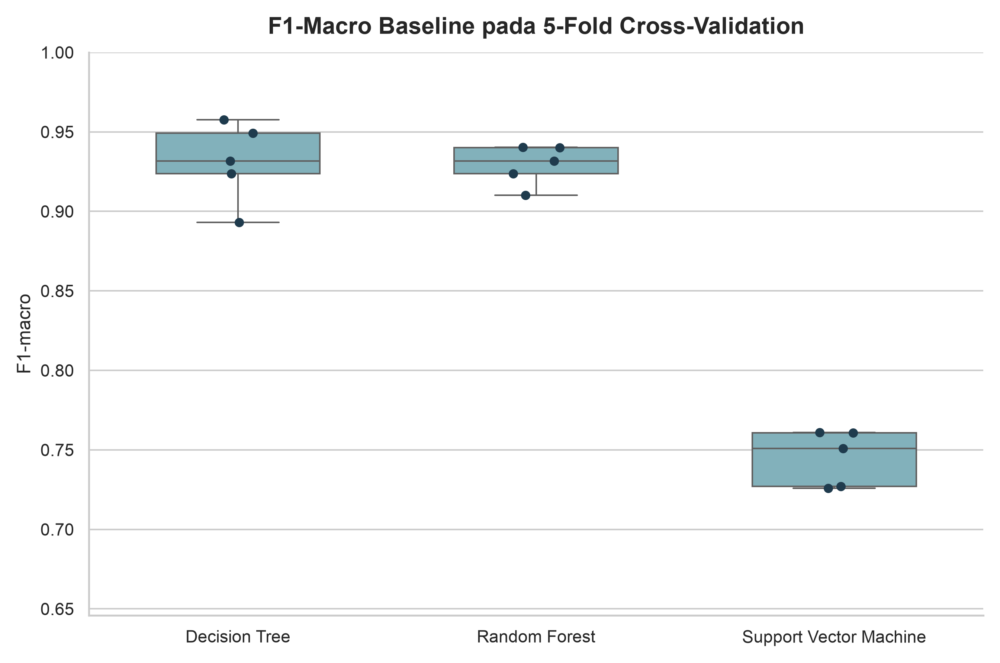

# Hasil Pemodelan Baseline

Eksperimen menggunakan 491 data latih dan tidak mengakses data uji. Setiap
model dievaluasi menggunakan 5-fold `StratifiedKFold` dengan shuffle dan
`random_state=42`. Imputer median dan `RobustScaler` di-fit ulang di dalam
setiap fold.

## Konfigurasi Model

| Model | Konfigurasi |
|---|---|
| Decision Tree | {"class_weight": null, "criterion": "gini", "max_depth": null, "min_samples_leaf": 1, "min_samples_split": 2, "random_state": 42, "splitter": "best"} |
| Random Forest | {"bootstrap": true, "class_weight": null, "criterion": "gini", "max_depth": null, "max_features": "sqrt", "min_samples_leaf": 1, "min_samples_split": 2, "n_estimators": 100, "random_state": 42} |
| Support Vector Machine | {"C": 1.0, "class_weight": null, "degree": 3, "gamma": "scale", "kernel": "rbf", "random_state": 42} |

Tidak digunakan oversampling, undersampling, atau `class_weight`. ROC-AUC
multiclass dihitung dengan pendekatan one-vs-rest dari probabilitas kelas untuk
model pohon dan decision score untuk SVM.

## Hasil Cross-Validation

Nilai ditampilkan sebagai rata-rata ± simpangan baku sampel dari lima fold.

| Model | Accuracy | Precision Macro | Recall Macro | F1 Macro | ROC-AUC OVR Macro |
|---|---|---|---|---|---|
| Decision Tree | 0.9186 ± 0.0275 | 0.9328 ± 0.0236 | 0.9304 ± 0.0264 | 0.9311 ± 0.0251 | 0.9507 ± 0.0180 |
| Random Forest | 0.9165 ± 0.0130 | 0.9330 ± 0.0130 | 0.9286 ± 0.0136 | 0.9292 ± 0.0127 | 0.9803 ± 0.0060 |
| Support Vector Machine | 0.7128 ± 0.0222 | 0.7677 ± 0.0286 | 0.7573 ± 0.0186 | 0.7451 ± 0.0175 | 0.9006 ± 0.0153 |

## Baseline Terpilih

Model baseline terpilih adalah **Decision Tree** berdasarkan
rata-rata `f1_macro` tertinggi. Pemilihan ini hanya digunakan
untuk menentukan model yang akan menjalani Grid Search. Data uji tetap belum
digunakan.

## Visualisasi

## Catatan

- Hasil baseline merupakan cross-validation pada data latih, bukan hasil akhir
  pada held-out test set.
- Nilai performa dapat dipengaruhi pola pembentukan dan kurasi menu.
- Model final baru dievaluasi satu kali pada data uji setelah hyperparameter
  tuning selesai.
