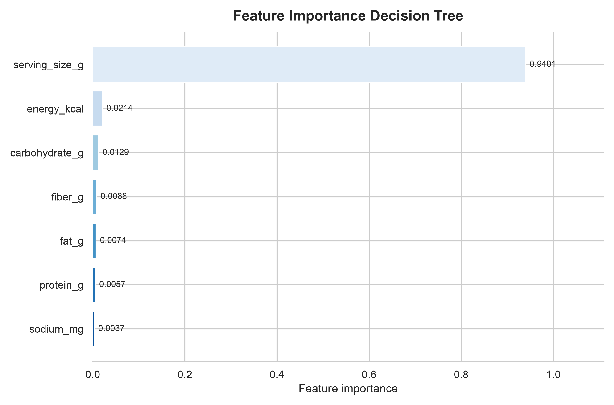

# Feature Importance Decision Tree

Feature importance diekstrak dari atribut `feature_importances_` pada Decision
Tree final yang telah di-fit. Held-out test set tidak dimuat atau dievaluasi
ulang pada tahap ini.

## Ranking Fitur

| Peringkat | Fitur | Importance | Persentase |
|---|---|---|---|
| 1 | `serving_size_g` | 0.9401 | 94.01% |
| 2 | `energy_kcal` | 0.0214 | 2.14% |
| 3 | `carbohydrate_g` | 0.0129 | 1.29% |
| 4 | `fiber_g` | 0.0088 | 0.88% |
| 5 | `fat_g` | 0.0074 | 0.74% |
| 6 | `protein_g` | 0.0057 | 0.57% |
| 7 | `sodium_mg` | 0.0037 | 0.37% |

Total importance: 1.0000.

## Interpretasi

Nilai merupakan kontribusi relatif fitur terhadap total penurunan impurity
pada seluruh split pohon. Nilai lebih besar berarti fitur lebih sering atau
lebih kuat digunakan model untuk memisahkan kelas.

## Keterbatasan

- Importance menjelaskan perilaku model yang telah di-fit, bukan hubungan sebab-akibat dengan kelas waktu makan.
- Fitur yang berkorelasi dapat saling membagi, menggantikan, atau mendistorsi importance yang terlihat.
- Impurity-based importance tidak menunjukkan apakah suatu fitur menaikkan atau menurunkan probabilitas kelas.
