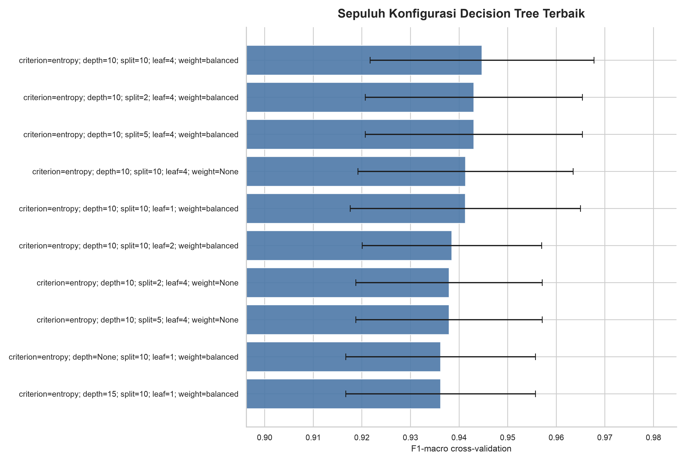

# Hasil Hyperparameter Tuning Decision Tree

Grid Search dilakukan hanya pada 491 data latih. Held-out test set tidak
digunakan.

## Ruang Pencarian

| Hyperparameter | Nilai |
|---|---|
| criterion | ['gini', 'entropy'] |
| max_depth | [None, 3, 5, 7, 10, 15] |
| min_samples_split | [2, 5, 10] |
| min_samples_leaf | [1, 2, 4] |
| class_weight | [None, 'balanced'] |

Jumlah kombinasi adalah 216, dievaluasi dengan
5-fold stratified cross-validation sehingga terdapat
1080 proses fit. Scoring utama adalah F1-macro.

## Hasil Terbaik

- Parameter terbaik: `{"classifier__class_weight": "balanced", "classifier__criterion": "entropy", "classifier__max_depth": 10, "classifier__min_samples_leaf": 4, "classifier__min_samples_split": 10}`
- F1-macro cross-validation terbaik: 0.9447
- Waktu Grid Search: 31.890 detik

## Perbandingan

| Kondisi | Accuracy | Precision Macro | Recall Macro | F1 Macro | ROC-AUC OVR Macro |
|---|---|---|---|---|---|
| baseline | 0.9186 ± 0.0275 | 0.9328 ± 0.0236 | 0.9304 ± 0.0264 | 0.9311 ± 0.0251 | 0.9507 ± 0.0180 |
| tuned | 0.9349 ± 0.0280 | 0.9458 ± 0.0239 | 0.9441 ± 0.0270 | 0.9447 ± 0.0258 | 0.9736 ± 0.0125 |

## Visualisasi

## Catatan

- Skor konfigurasi tuned telah dioptimalkan pada fold Grid Search yang sama,
  sehingga bukan estimasi final yang independen.
- Model final harus dievaluasi satu kali pada held-out test set.
- Artefak model menyimpan pipeline preprocessing, Decision Tree, encoder
  target, daftar fitur, dan metadata versi.
